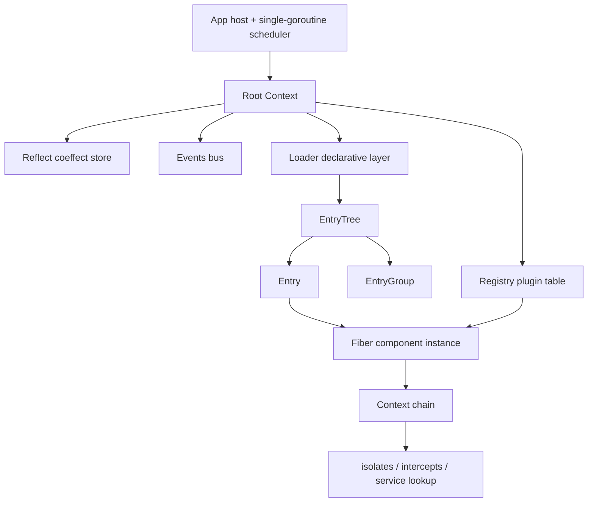
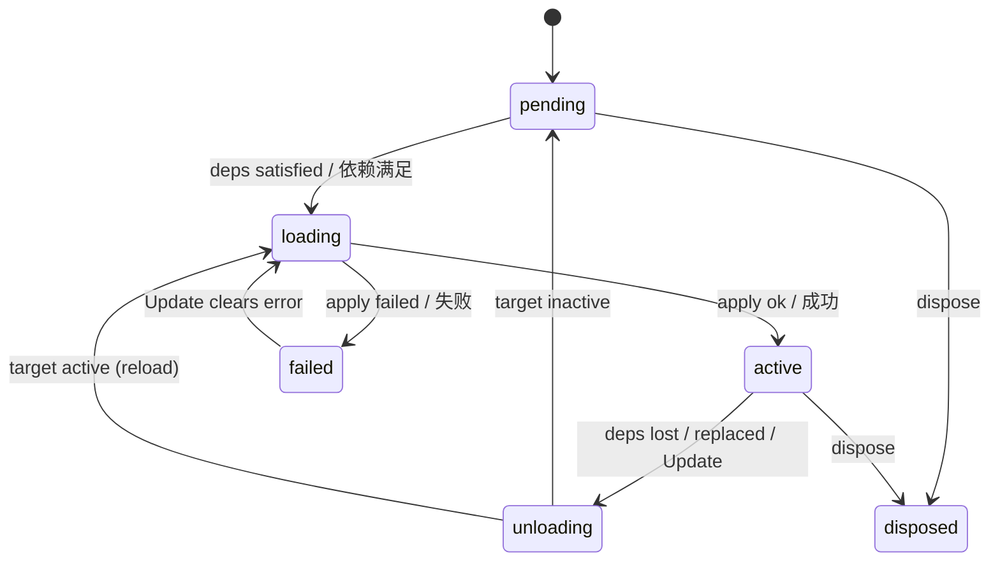

# Cordis (Go)

[](https://github.com/metaRobin/cordis/actions/workflows/ci.yml)

> 论文《[A Programming Paradigm for Spatiotemporal Composability](https://arxiv.org/abs/2608.25512)》所提出的**时空可组合组件模型**的纯 Go 实现。
> 零第三方依赖 · 单 goroutine 免锁运行时 · 39 项测试全绿（含 `-race`）· Apache-2.0
>
> A pure Go implementation of the **spatiotemporal composability** component model from *[A Programming Paradigm for Spatiotemporal Composability](https://arxiv.org/abs/2608.25512)*.
> Zero third-party dependencies · single-goroutine lock-free runtime · 39 tests green (incl. `-race`) · Apache-2.0

> **文档约定 / Conventions**
> 正文按「中文段 → `**English**` 段」逐节对照；表格在单元格内双语（`中文 / English`），以免整表重复。
> Prose alternates a Chinese block followed by an `**English**` block; tables carry both languages inside each cell so the table itself is not duplicated.

---

## 1. 项目简介 / Overview

`cordis` 是一套**组件运行时**：它让「组件」在两个维度上同时可组合。

| 维度 / Dimension | 主张 / Claim | 本实现的机制 / Mechanism |
| --- | --- | --- |
| **时间维** temporal | 每个副作用都携带**显式的逆操作**，由运行时追踪；组件卸载时环境被完全还原 / Every side effect carries an **explicit inverse** tracked by the runtime, so removing a component fully restores the environment | `ctx.Effect` / `ctx.Provide` / `ctx.On` 一律返回 `Dispose`，Fiber 卸载时按 **LIFO 逆序**自动回收 / all return a `Dispose`, reclaimed in **LIFO order** on unload |
| **空间维** spatial | 组件以**协效应（coeffect）**声明对服务的依赖；依赖满足状态变化时，运行时自动驱动组件的加载与卸载 / Components declare service dependencies as **coeffects**; the runtime drives load/unload as satisfaction changes | `Plugin.Inject` 声明依赖 → `epoch` 推导目标视图 → 状态机自动奔跑 / `Plugin.Inject` feeds an `epoch`-derived target view that the state machine chases |

一句话：**你只声明「我要什么」和「我怎么创建」，运行时负责在正确的时机创建、在依赖消失时彻底拆掉。**

**English**

`cordis` is a **component runtime**: it makes components composable along two dimensions at once — the table above pairs each dimension with the mechanism this implementation uses for it.

In one sentence: **you declare only what you need and how to create it; the runtime creates it at the right moment and tears it down completely when its dependencies disappear.**

---

## 2. 核心概念 / Core Concepts

| 概念 / Concept | 论文 / 官方 TS 实现<br>Paper / official TS | 本实现 / This implementation | 说明 / Notes |
| --- | --- | --- | --- |
| 组件定义 / component definition | plugin | `Plugin` | `Name` + `Inject`（协效应 / coeffect）+ `Validate`（配置校验 / config validation）+ `Apply`（组件逻辑 / component logic） |
| 组件实例 / component instance | fiber / scope | `Fiber` | 持有效果追踪表、依赖快照、对外服务表与生命周期状态机 / Holds the effect table, dependency snapshot, exposed services and lifecycle state machine |
| 目标视图 / target view | `epoch` | `epoch`（未导出 / unexported） | 由当前依赖实现集合推导；任何替换都产生新 epoch / Derived from the current set of dependency implementations; any replacement yields a new epoch |
| 协效应存储 / coeffect store | `ReflectService` | `Reflect` | `isolateKey{name, realm}` → 服务实现的全局映射 / Global map from `isolateKey{name, realm}` to service implementation |
| 隔离域 / isolation realm | isolation / realm | `Context.Isolate` | 同名服务在不同域中互不可见，支持多套服务栈并存（多租户）/ Same-named services in different realms are mutually invisible, allowing several service stacks to coexist (multi-tenancy) |
| 拦截配置 / intercept config | intercept | `Context.Intercept` | 由服务提供者读取的构造期配置，沿上下文链合并 / Construction-time config read by the provider, merged along the context chain |
| 事件总线 / event bus | events | `Events` | 监听器随注册它的 Fiber 生命周期自动回收 / Listeners are reclaimed with the Fiber that registered them |
| 声明式配置 / declarative config | loader | `Loader` | `Entry` / `EntryGroup` / `EntryTree` + 协调算法 / plus the reconciliation algorithm |

**English**

The table above maps every concept of the paper and the official TypeScript implementation onto its counterpart here, so the two can be read side by side. The right-hand column records what the Go type actually holds, and the notes flag the semantics that matter when porting.

---

## 3. 架构总览 / Architecture



分三层：

1. **宿主层** —— `App` 持有根上下文与调度器 goroutine；`App.Do` / `App.DoSync` 是外部 goroutine 的唯一合法入口。
2. **运行时层** —— `Fiber` / `Context` / `Reflect` / `Registry` / `Events` 构成效果追踪与依赖解析的全部机制。
3. **声明式配置层** —— `Loader` / `EntryTree` / `EntryGroup` / `Entry` 把「实例化组件」从过程式代码变为可协调的配置树。

**English**

Three layers, matching the diagram:

1. **Host layer** — `App` owns the root context and the scheduler goroutine. `App.Do` / `App.DoSync` are the only legal entry points for outside goroutines.
2. **Runtime layer** — `Fiber` / `Context` / `Reflect` / `Registry` / `Events` provide all effect tracking and dependency resolution.
3. **Declarative layer** — `Loader` / `EntryTree` / `EntryGroup` / `Entry` turn "instantiate a component" from procedural code into a reconcilable configuration tree.

### 文件职责 / File Responsibilities

| 文件 / File | 行数 / Lines | 职责 / Responsibility |
| --- | --- | --- |
| `cordis.go` | 93 | 包文档、`FiberState`、错误值集合、`Plugin` 定义 / Package doc, `FiberState`, error values, `Plugin` |
| `app.go` | 225 | `App` 宿主、单 goroutine `scheduler`、`Wait` / `Close` / Host, scheduler, `Wait` / `Close` |
| `context.go` | 203 | 统一上下文、`Isolate` / `Intercept` 派生、`Get` / `Provide` 门面 / Unified context, `Isolate` / `Intercept` derivation, `Get` / `Provide` facade |
| `fiber.go` | 561 | Fiber 状态机、`epoch` 惯性追逐、效果与 LIFO 撤销、配置热更新 / State machine, epoch chasing, effects and LIFO disposal, hot config update |
| `reflect.go` | 241 | 协效应存储、域键解析、依赖倒排索引与变更通知（dependant-first）/ Coeffect store, realm key resolution, reverse dependency index and notifications |
| `registry.go` | 193 | `Plugin → Runtime` 映射、`Plugin` / `PluginInject` / `Inject` 实例化入口 / Mapping and instantiation entry points |
| `events.go` | 189 | 事件总线（`Emit` / `Serial` / `Bail` / `Parallel`）与 `Logger` / Event bus and `Logger` |
| `disposable.go` | 72 | 两阶段撤销步骤 `disposeStep` 与保序 `disposableList` / Two-phase dispose steps and the order-preserving list |
| `loader.go` | 788 | 声明式配置层：`EntryOptions` / `Entry` / `EntryGroup` / `EntryTree` / `Loader` / Declarative configuration layer |
| `example/main.go` | 174 | 端到端示例：数据库 + 缓存 + Web，覆盖热重载 / 降级 / 隔离域 / End-to-end example covering hot reload, degradation and isolation |
| `cordis_test.go` | 1078 | 核心运行时测试（22 项 + 1 基准）/ Core runtime tests (22 + 1 benchmark) |
| `loader_test.go` | 707 | 声明式配置层测试（15 项 + 1 基准）/ Loader tests (15 + 1 benchmark) |
| `index_internal_test.go` | 60 | 依赖倒排索引的生命周期不变量（白盒）/ Reverse index lifecycle invariants (white-box) |
| `disposable_internal_test.go` | 125 | 墓碑压缩的不变量与基准（1 项 + 3 基准，白盒）/ Tombstone compaction invariants and benchmarks (white-box) |

---

## 4. 快速开始 / Quick Start

```bash
git clone git@github-metaRobin:metaRobin/cordis.git
cd cordis

go test ./...          # 39 项测试 / 39 tests
go test -race ./...    # 竞态检测 / race detector
go vet ./...
go run ./example       # 端到端示例，打印各入口状态 / end-to-end demo
```

### 作为依赖使用 / Using as a Dependency

`go.mod` 中模块路径为裸名 `cordis`（非域名路径），本地引用需显式 `replace`：

The module path in `go.mod` is the bare name `cordis` (not a domain path), so a local reference needs an explicit `replace`:

```
// 你的项目 go.mod / your go.mod
require cordis v0.0.0

replace cordis => ../cordis
```

```go
import cordis "cordis"
```

> 若需直接 `go get`，把 `go.mod` 的 `module` 改为完整路径（如 `github.com/metaRobin/cordis`）并同步修正 `example/main.go` 的 import。
> To `go get` it directly, change `module` in `go.mod` to a full path (e.g. `github.com/metaRobin/cordis`) and update the import in `example/main.go` accordingly.

---

## 5. 使用指南 / Usage

### 5.1 定义与实例化组件 / Defining and Instantiating

```go
app := cordis.New()
defer app.Close()

db := &cordis.Plugin{
    Name: "database",
    Apply: func(ctx *cordis.Context, config any) error {
        dsn := config.(string)
        if _, err := ctx.Provide("database", dsn, nil); err != nil {
            return err
        }
        _, err := ctx.Effect("conn", func() (cordis.Dispose, error) {
            return func() { log.Println("close", dsn) }, nil
        })
        return err
    },
}

app.Do(func(ctx *cordis.Context) {
    ctx.Plugin(db, "postgres://prod")
})
```

### 5.2 副作用与撤销 / Effects and Disposal

所有副作用都必须能给出逆操作，且 `Dispose` **幂等**。Every side effect must supply an inverse, and every `Dispose` must be **idempotent**.

| API | 用途 / Purpose |
| --- | --- |
| `ctx.Effect(label, fn)` | 通用效果：`fn` 返回 `Dispose` / General effect: `fn` returns a `Dispose` |
| `ctx.EffectIter(label, iter)` | 增量效果：`yield` 多次登记，全部 LIFO 撤销 / Incremental: yields many times, all disposed LIFO |
| `ctx.Provide(name, value, check)` | 注册服务，撤销遵循 **dependant-first**（先等依赖者下线，再销毁自身）/ Registers a service; disposal is **dependant-first** |
| `ctx.On` / `ctx.Once` | 注册事件监听器，随 Fiber 卸载自动注销 / Event listeners, auto-removed with the Fiber |

### 5.3 服务与反应式依赖 / Services and Reactive Dependencies

```go
cache := &cordis.Plugin{
    Name:   "cache",
    Inject: map[string]any{"database": nil}, // 协效应：必需依赖
    Apply: func(ctx *cordis.Context, _ any) error {
        dsn, ok := ctx.Get("database")
        if !ok {
            return errors.New("database unavailable")
        }
        _, err := ctx.Provide("cache", "cache:"+dsn.(string), nil)
        return err
    },
}
```

`database` 提供者下线时，`cache` 的效果被自动回收并回到 `pending`；提供者回归时自动恢复。**无需手写任何监听或重试逻辑。**

`Provide` 的第三个参数 `check func() bool` 用于表达「服务存在但暂不可用」：每次依赖解析都会调用它，返回 `false` 时依赖者立即视为未满足。`check` 内 panic 会被吞掉并按未满足处理（记日志）。

**English**

When the `database` provider goes away, the effects of `cache` are reclaimed automatically and it returns to `pending`; it comes back on its own once the provider returns. **No listener or retry logic has to be written by hand.**

The third argument of `Provide`, `check func() bool`, expresses "the service exists but is temporarily unusable": it is called on every dependency resolution, and returning `false` makes the dependent count as unsatisfied immediately. A panic inside `check` is swallowed and treated as unsatisfied (and logged).

### 5.4 隔离域（多租户）/ Isolation Realms (Multi-Tenancy)

```go
ctx.Isolate("database", "tenant-a")   // 同域共享，跨域不可见
ctx.Intercept("database", myConfig)   // 供提供者读取的拦截配置
```

在 loader 层用 `EntryOptions.Isolate` 声明：`true` 表示入口私有域（键 `#入口ID`），字符串表示共享域（键 `@标签`）。

**English**

Declared at the loader layer through `EntryOptions.Isolate`: `true` means a realm private to that entry (key `#entryID`), while a string means a shared realm (key `@label`).

### 5.5 事件 / Events

| 方法 / Method | 语义 / Semantics |
| --- | --- |
| `Emit` | 同步分发，忽略返回值与错误（错误记日志）/ Synchronous, ignores return values and errors (errors are logged) |
| `Serial` | 串行，首个返回非 nil 的监听器终止分发 / Serial; the first non-nil result stops dispatch |
| `Bail` | 同 `Serial`，但同步抛出 panic / Like `Serial`, but throws synchronously |
| `Parallel` | 聚合全部错误（单线程下等价于串行）/ Aggregates all errors (equivalent to serial under one thread) |
| `EmitFiltered` | 带显式域过滤规则分发 / Dispatch with explicit realm filtering |

内置事件：`internal/plugin`（实例创建/注销）、`internal/status`（状态迁移）、`internal/service`（服务上下线）。
Built-in events: `internal/plugin` (instance created/disposed), `internal/status` (state transitions), `internal/service` (service up/down).

### 5.6 声明式配置层 / Declarative Configuration

```go
loader := cordis.NewLoader(app, func(name string) (*cordis.Plugin, error) {
    return plugins[name], nil
})

loader.Load([]cordis.EntryOptions{
    {ID: "db",    Name: "database", Config: "postgres://prod"},
    {ID: "cache", Name: "cache"},
    {ID: "web",   Name: "web",      Config: 8080},
})
```

| 操作 / Operation | 行为 / Behavior |
| --- | --- |
| `Load(options)` | 整体协调：新增创建、缺失移除、存留更新，顺序以配置为准 / Full reconciliation: create, remove and update, in configuration order |
| `Create` / `Remove` / `Update` | 单入口增删改；`Update` 支持跨组移动（触发上下文重建 + 完整重载）/ Single-entry operations; `Update` can move across groups, rebuilding the context and reloading fully |
| `EntryGroup` | 分组入口，`Group: true`；禁用级联会禁用全部后代 / Group entry; disabling cascades to all descendants |
| `EntryOptions.ID` | **全树唯一**（索引以短 ID 为键，寻址用 `group:child` 路径）；重复 ID 被拒绝（跳过并记日志）/ **Unique across the tree**; duplicates are rejected and logged |
| `EntryOptions.Inject` | 入口级依赖增删覆盖（`cordis.DepRemove` 显式移除声明的依赖）/ Entry-level dependency overrides |
| `EntryTree.OnCommit` | 每次结构变更后同步回调，供持久化落盘 / Synchronous callback after every structural change, for persistence |
| `NewLoader` | 同名插件可多次实例化，共享 `Runtime` / The same plugin may be instantiated many times, sharing one `Runtime` |

配置变更的分派规则（`Entry.update`）：
Dispatch rules for configuration changes (`Entry.update`):

- 禁用（含级联）→ 注销 Fiber 并摘下分组子树；
  Disable (including cascading) disposes the Fiber and detaches the group subtree.
- 空间声明变化（`Name` / `Group` / `Inject` / `Isolate` / `Intercept`）→ **同步摘下旧子树**、注销旧实例，再以新声明完整重载（旧实例的效果回收是异步的，子树结构必须立即一致，否则重建时短 ID 索引冲突）；
  A change to a spatial declaration (`Name` / `Group` / `Inject` / `Isolate` / `Intercept`) **detaches the old subtree synchronously**, disposes the old instance, then reloads fully under the new declaration. Effect reclamation is asynchronous, so the subtree structure must be consistent immediately or the short-id index collides during the rebuild.
- 仅 `Config` 变化 → 走 `Fiber.Update` 热重载；配置未过 `Validate` 时 Fiber 进入 `failed` 并保留在入口上，修正后原地恢复；
  A change to `Config` alone goes through `Fiber.Update`. If it fails `Validate`, the Fiber enters `failed` and stays on the entry, recovering in place once corrected.
- 分组入口 → 通过更新钩子协调子入口，而非重启自身；分组配置类型错误（非 `[]EntryOptions`）记日志并保留现有子入口。
  A group entry reconciles its children through update hooks rather than restarting itself; a group config of the wrong type (not `[]EntryOptions`) is logged and the existing children are kept.

---

## 6. 并发模型 / Concurrency Model

复刻 JavaScript 单线程事件循环：`App` 内置**唯一一个**调度 goroutine，全部状态转换任务在其中**串行**执行。

- **用户回调（`Apply` / `Dispose` / 事件监听器）天然运行于调度器内**，可直接调用 `Context` 上的任何 API，**无需加锁**。
- 外部 goroutine 一律通过 `App.Do`（异步）或 `App.DoSync`（同步阻塞）进入。
- ⚠️ **不得在调度器上下文内调用 `DoSync` / `Wait`** —— 会死锁。
- 任务队列为**无界 slice + 互斥锁**（不是固定容量 channel）：单个任务内部继续投递任务不会自阻塞，语义与 JS 事件循环一致。

`App.Wait()` 阻塞至队列排空且全部 Fiber 稳定，**返回是否真正收敛**（调度器已停止或达到轮询上限后放弃时返回 `false` 并告警）；`App.Close()` 冻结根 fiber 目标视图，沿效果链级联回收全部子组件并停止调度器（可安全重复调用）。

**English**

This replicates the JavaScript single-threaded event loop: `App` runs **exactly one** scheduler goroutine, and every state transition executes **serially** on it.

- **User callbacks (`Apply` / `Dispose` / event listeners) run inside the scheduler by construction**, so they may call any `Context` API directly, **with no locking**.
- Outside goroutines enter only through `App.Do` (asynchronous) or `App.DoSync` (blocking).
- ⚠️ **Never call `DoSync` / `Wait` from inside the scheduler** — that deadlocks.
- The task queue is an **unbounded slice behind a mutex**, not a fixed-capacity channel: posting from within a task cannot self-block, matching JS event-loop semantics.

`App.Wait()` blocks until the queue is drained and every Fiber is stable, and **returns whether the system truly converged** (it returns `false` and warns if the scheduler stopped or a polling limit was hit). `App.Close()` freezes the root fiber's target view, cascades reclamation down the effect chain and stops the scheduler; it is safe to call repeatedly.

---

## 7. 生命周期状态机 / Lifecycle State Machine

| 状态 / State | 含义 / Meaning |
| --- | --- |
| `pending` | 已注册但依赖未满足，等待激活 / Registered, dependencies unsatisfied, waiting |
| `loading` | 依赖已满足，正在执行组件逻辑 / Dependencies satisfied, running component logic |
| `active` | 组件逻辑执行成功且全部依赖仍然满足 / Logic succeeded and all dependencies still hold |
| `failed` | 曾在 `active` 之后执行失败；效果已回收，等待下次 `Update` 恢复 / Failed after having been active; effects reclaimed, awaiting `Update` |
| `unloading` | 正在按 LIFO 逆序回收效果 / Reclaiming effects in LIFO order |
| `disposed` | 已从父上下文注销，生命周期终结 / Unregistered from the parent; lifecycle over |



**epoch 惯性链**：epoch 变化并不立即执行转换，而是把 `pump` 任务投递到调度器。`pump` 按**最新** epoch 决策，转换完成后若 epoch 又变（同步代码在转换期间再次改变目标视图）则继续追逐，直到现状与目标一致——等价于官方实现的 reload/unload 相互链式触发。

**English**

**Epoch inertia chain.** An epoch change does not transition immediately; it posts a `pump` task to the scheduler. `pump` decides against the **latest** epoch, and if the epoch changed again while it was transitioning — synchronous code moving the target view mid-transition — it keeps chasing until the current state matches the target. This is equivalent to the mutually chained reload/unload of the official implementation.

---

## 8. API 速览 / API Reference

### `App`

| 方法 / Method | 说明 / Description |
| --- | --- |
| `New()` | 创建应用并启动调度器 / Creates the app and starts the scheduler |
| `Do(f)` / `DoSync(f)` | 在调度器上异步 / 同步执行；`DoSync` 返回任务是否确实执行完毕 / Run async / sync; `DoSync` reports whether the task actually ran |
| `Root()` | 根上下文（仅限调度器上下文使用）/ Root context, scheduler-side only |
| `Wait()` | 等待系统稳定，返回是否收敛 / Waits for stability, returns whether it converged |
| `Close()` | 级联回收全部组件并停止调度器 / Cascades reclamation and stops the scheduler |
| `Logger()` | 取日志器（`Error` / `Warn` / `Info` 均可替换）/ Logger accessor; `Error` / `Warn` / `Info` are all replaceable |

### `Context`

| 方法 / Method | 说明 / Description |
| --- | --- |
| `Get(name)` / `GetMust(name)` | 解析服务（沿 Fiber 链向上，域感知；提供者未 `active` 时视为不可见）/ Resolves a service up the Fiber chain, realm-aware; invisible unless the provider is `active` |
| `Provide(name, value, check)` | 注册服务，返回与 Fiber 绑定的 `Dispose` / Registers a service, returning a Fiber-bound `Dispose` |
| `Set(name, value)` | 更新本 Fiber 已注册的服务值 / Updates a value registered by this Fiber |
| `Effect` / `EffectIter` / `On` / `Once` / `Emit` | 效果与事件 / Effects and events |
| `Isolate(name, realm)` / `Intercept(name, cfg)` / `InterceptOf(name)` | 空间维声明 / Spatial declarations |
| `Plugin(p, config)` / `Inject(deps, apply)` | 实例化组件 / 声明动态依赖 / Instantiate a component / declare dynamic dependencies |
| `App()` / `Fiber()` / `Root()` / `Entry()` | 上下文导航 / Context navigation |

### `Registry` 的错误契约 / Error Contract

| 返回 / Return | 含义 / Meaning |
| --- | --- |
| `(nil, err)` | 结构性失败（插件无效或父上下文已失活），Fiber 从未注册 / Structural failure; the Fiber was never registered |
| `(f, err)` | 配置未通过 `Validate`——Fiber 已注册且处于 `failed`，可经 `f.Update` 修复或 `f.Dispose` 注销 / Config failed `Validate`; the Fiber is registered and `failed`, fixable via `f.Update` or disposable via `f.Dispose` |
| `(f, nil)` | 成功 / Success |

### `Fiber`

`State()` · `Err()` · `Config()` · `UID()` · `Update(config)` · `OnUpdate(hook)` · `Dispose()` · `Effect(label, fn)` · `EffectIter(label, iter)`

### 错误值 / Error Values

`ErrInactiveEffect` · `ErrServiceDuplicate` · `ErrServiceNotFound` · `ErrInvalidPlugin` · `ErrEntryNotFound`

---

## 9. 示例输出 / Example Output

`go run ./example` 覆盖四个场景。`go run ./example` covers four scenarios.

| 场景 / Scenario | 观察点 / What to watch |
| --- | --- |
| 初始加载 / initial load | 依赖序驱动：`database` → `cache` → `web` / Driven by dependency order |
| 热重载 `web: 8080 → 9090` / hot reload | 旧实例先 `shutdown`，新实例再 `listen` / The old instance shuts down before the new one listens |
| `db` 禁用 / 恢复 / disable and restore | `cache`、`web` 自动回到 `pending`，恢复后自动 `active` / Both return to `pending` and come back automatically |
| 隔离域多租户双栈 / two-tenant stacks | `tenant-a` / `tenant-b` 同名服务并存互不干扰 / Same-named services coexist without interference |
| 动态移除 `db-b` / removing `db-b` | 该栈整体降级，`tenant-a` 不受影响 / That stack degrades while `tenant-a` is unaffected |

---

## 10. 测试覆盖 / Test Coverage

`go test ./...` → **39 项全部通过 / 39 tests pass**；`go test -race ./...` 无竞态报告 / no race reports；另有 5 个基准（`-bench .`）/ plus 5 benchmarks.

CI（`.github/workflows/ci.yml`）在 **Go 1.22.x**（`go.mod` 声明的最低版本）与 **stable** 两档上执行：`gofmt -l` 零差异、`go vet`、`go build`、`go test -race`、基准运行、`go run ./example` 冒烟。

**English**

CI (`.github/workflows/ci.yml`) runs on both **Go 1.22.x** (the minimum declared in `go.mod`) and **stable**: `gofmt -l` must be clean, then `go vet`, `go build`, `go test -race`, the benchmarks, and an example smoke run.

**核心运行时（`cordis_test.go`，22 项）/ Core runtime (22 tests)**

| 测试 / Test | 覆盖点 / Coverage |
| --- | --- |
| `TestPluginLifecycle` | 生命周期状态迁移 / lifecycle transitions |
| `TestReactiveCoeffects` | 反应式依赖：提供者上下线驱动依赖者 / reactive deps |
| `TestDependantFirstDispose` | 撤销顺序保证 / disposal ordering |
| `TestIsolation` / `TestSharedRealm` | 私有域 / 共享域语义 / private and shared realms |
| `TestHotReload` | 配置热重载 / hot config reload |
| `TestFailureAndRecovery` | `apply` 失败与 `Update` 恢复 / failure and recovery |
| `TestConfigValidation` / `TestPluginErrorContract` | `Validate` 失败路径与错误契约 / validation and error contract |
| `TestServiceEvents` | `internal/service` 事件 / service events |
| `TestDuplicateProvide` | 同域重复注册 / duplicate registration |
| `TestEpochChase` | 转换期间 epoch 再次变化的追逐 / epoch chasing mid-transition |
| `TestEventListenerCleanup` | 监听器随 Fiber 回收 / listener cleanup |
| `TestRootCloseCascades` | 根关闭级联 / cascading root close |
| `TestCheckFunction` | `check` 不健康判定 / unhealthy `check` |
| `TestServiceHiddenWhileProviderUnloading` | 撤销窗口内服务可见性 / visibility during disposal |
| `TestDisposePanicLogged` | 撤销 panic 被记录且不阻断后续 / panics logged, not propagated |
| `TestWaitReportsConvergence` | `Wait` / `DoSync` 的收敛与执行结果上报 / convergence reporting |
| `TestSchedulerUnboundedQueue` | 单任务内超量投递不自死锁 / no self-deadlock on overflow |
| `TestConcurrentExternalCalls` | 8 goroutine 混合 `Do`/`DoSync`：任务不丢失不重复、调度严格串行、执行结果如实上报 / no lost or duplicated tasks, strict serialization |
| `TestConcurrentPluginRegistration` | 并发注册 160 个实例，全部收敛为 `active` / 160 concurrent registrations all reach `active` |
| `TestConcurrentCloseWithPosts` | `Close` 与外部投递并发：无死锁、无 panic、幂等 / no deadlock, no panic, idempotent |

**声明式配置层（`loader_test.go`，15 项）/ Loader (15 tests)**

| 测试 / Test | 覆盖点 / Coverage |
| --- | --- |
| `TestLoaderBasicLoad` / `TestLoaderReconcile` / `TestLoaderConfigReload` | 加载、整体协调、配置热重载 / load, reconcile, reload |
| `TestLoaderGroup` / `TestLoaderGroupIsolateRebuild` / `TestLoaderGroupConfigTypeError` | 分组协调、空间声明变化重建、配置类型错误保留子树 / group reconcile and rebuild |
| `TestLoaderEntryIsolate` / `TestLoaderEntryInject` | 入口级域与依赖声明 / entry-level realm and deps |
| `TestLoaderTreeOperations` / `TestLoaderGroupMoveRebuild` | 入口树增删改与跨组移动（含分组子树同步摘下重建）/ tree edits and cross-group moves |
| `TestLoaderDuplicateShortID` | 重复短 ID 拒绝（含跨组）/ duplicate short-id rejection |
| `TestLoaderConfigErrorRecovery` | 校验失败后原地恢复 / recovery after a validation failure |
| `TestLoaderCommitHook` / `TestLoaderSelfDispose` | 提交钩子、插件自行卸载 / commit hook, self-dispose |
| `TestLoaderLargeLoad` | 1100 入口单次 Load 不死锁 / 1100 entries in one load |

**内部不变量（`index_internal_test.go`，1 项，白盒）/ Internal invariants (white-box)**

`TestReflectIndexLifecycle` —— 依赖倒排索引的 track/untrack 严格配对（注销、未注册失败路径与 `Close` 级联后索引回空）
`TestReflectIndexLifecycle` — strict track/untrack pairing for the reverse dependency index (disposal, unregistered failure paths, and the index draining to empty after a cascading `Close`).

**内部不变量（`disposable_internal_test.go`，1 项，白盒）/ Internal invariants (white-box)**

`TestDisposableCompactionPreservesOrder` —— 墓碑压缩确实触发（`order > 8` 且 `order > 2×存活数`），且按 `id` 排序重建后 LIFO 序不破
`TestDisposableCompactionPreservesOrder` — compaction actually fires (`order > 8` and `order > 2× live`), and the sort-based rebuild preserves LIFO order.

**基准 / Benchmarks**

| 基准 / Benchmark | 度量对象 / What it measures |
| --- | --- |
| `BenchmarkServiceNotify` | 服务上下线通知代价（倒排索引前后对比见提交历史）/ cost of service notifications |
| `BenchmarkLoaderLoad` | 声明式协调吞吐 / reconciliation throughput |
| `BenchmarkDisposableSteadyChurn` | 固定存活集持续更替的摊还成本（含摊入的墓碑重建）/ amortized churn cost including rebuilds |
| `BenchmarkDisposableCompaction` | 隔离的单次 `order` 重建（map 遍历 + 排序）/ an isolated rebuild |
| `BenchmarkDisposableClear` | `clear` 成本与历史操作量的关系（压缩生效时应持平）/ clear cost against history length |

墓碑压缩三项基准的实测数据与判读见审查报告表 3：存活集 64× 增长时单次更替成本仅 2.2×；历史操作量 64× 增长时 `clear` 成本持平，印证 `order` 未随运行时长累积。

**English**

Measured numbers for the three compaction benchmarks, with interpretation, are in table 3 of the code review report: growing the live set 64× costs only 2.2× per churn, and `clear` stays flat while the history grows 64×, which is the evidence that `order` does not accumulate over a long-lived list.

---

## 11. 参考 / References

- **论文 / Paper**：[A Programming Paradigm for Spatiotemporal Composability](https://arxiv.org/abs/2608.25512)（arXiv:2608.25512 · [DOI](https://doi.org/10.48550/arXiv.2608.25512)，北京大学 & DeepSeek-AI 联合署名，2026-08-26）—— 时空可组合组件模型的理论来源；论文源文件见 [cordiverse/paper](https://github.com/cordiverse/paper)
  The theoretical source of the spatiotemporal composability model, by authors from Peking University and DeepSeek-AI; the paper's source files live in [cordiverse/paper](https://github.com/cordiverse/paper).
- **官方 TypeScript 实现 / Official TypeScript implementation**：[cordiverse/cordis](https://github.com/cordiverse/cordis)（npm [`cordis`](https://www.npmjs.com/package/cordis)，MIT）—— 本仓库逐模块对照的语义基准（概念映射见 §2）
  The semantic baseline this repository mirrors module by module (concept mapping in §2).
- 包级设计说明见 `cordis.go` 顶部注释；各模块内部设计取舍见对应源文件注释。
  Package-level design notes are in the header comment of `cordis.go`; per-module tradeoffs are in the corresponding source files.

---

## 12. 许可 / License

本项目采用 [Apache License 2.0](LICENSE) 授权，全文见仓库根目录 `LICENSE`。
This project is licensed under the [Apache License 2.0](LICENSE); the full text is in `LICENSE` at the repository root.

```
Copyright 2026 metaRobin

Licensed under the Apache License, Version 2.0 (the "License");
you may not use this file except in compliance with the License.
You may obtain a copy of the License at

    http://www.apache.org/licenses/LICENSE-2.0

Unless required by applicable law or agreed to in writing, software
distributed under the License is distributed on an "AS IS" BASIS,
WITHOUT WARRANTIES OR CONDITIONS OF ANY KIND, either express or implied.
See the License for the specific language governing permissions and
limitations under the License.
```

> 注意：本仓库对照的**官方 TypeScript 实现**为独立项目，其授权与本仓库无关；论文版权归原作者所有。
> Note: the **official TypeScript implementation** is an independent project whose license is unrelated to this repository; copyright of the paper belongs to its authors.