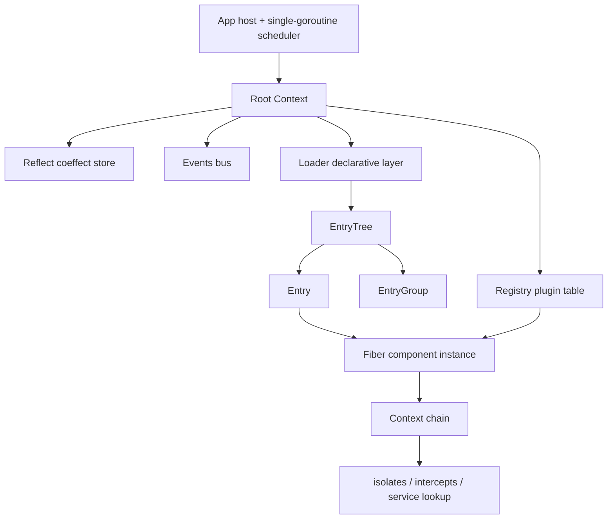
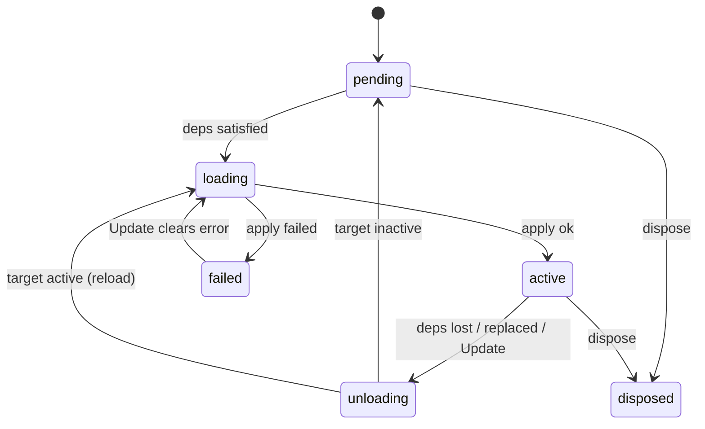

# Cordis (Go)

[](https://github.com/corecraft-io/cordis/actions/workflows/ci.yml)

**English** · [中文](README.zh-CN.md)

> A pure Go implementation of the **spatiotemporal composability** component model from *[A Programming Paradigm for Spatiotemporal Composability](https://arxiv.org/abs/2608.25512)*.
> Zero third-party dependencies · single-goroutine lock-free runtime · 65 tests green (incl. `-race`) · Apache-2.0

---

## 1. Overview

`cordis` is a **component runtime**: it makes components composable along two dimensions at once.

| Dimension | Claim | Mechanism |
| --- | --- | --- |
| **Temporal** | Every side effect carries an **explicit inverse** tracked by the runtime, so removing a component fully restores the environment | `ctx.Effect` / `ctx.Provide` / `ctx.On` all return a `Dispose`, reclaimed in **LIFO order** on unload |
| **Spatial** | Components declare service dependencies as **coeffects**; the runtime drives load/unload as satisfaction changes | `Plugin.Inject` feeds an `epoch`-derived target view that the state machine chases |

In one sentence: **you declare only what you need and how to create it; the runtime creates it at the right moment and tears it down completely when its dependencies disappear.**

---

## 2. Core Concepts

| Concept | Paper / official TS | This implementation | Notes |
| --- | --- | --- | --- |
| component definition | plugin | `Plugin` | `Name` + `Inject` (coeffect) + `Validate` (config validation) + `Apply` (component logic) |
| component instance | fiber / scope | `Fiber` | Holds the effect table, dependency snapshot, exposed services and lifecycle state machine |
| target view | `epoch` | `epoch` (unexported) | Derived from the current set of dependency implementations; any replacement yields a new epoch |
| coeffect store | `ReflectService` | `Reflect` | Global map from `isolateKey{name, realm}` to service implementation |
| isolation realm | isolation / realm | `Context.Isolate` | Same-named services in different realms are mutually invisible, allowing several service stacks to coexist (multi-tenancy) |
| intercept config | intercept | `Context.Intercept` | Construction-time config read by the provider, merged along the context chain |
| event bus | events | `Events` | Listeners are reclaimed with the Fiber that registered them |
| declarative config | loader | `Loader` | `Entry` / `EntryGroup` / `EntryTree` plus the reconciliation algorithm |

The table maps every concept of the paper and the official TypeScript implementation onto its counterpart here, so the two can be read side by side. The right-hand column records what the Go type actually holds, and the notes flag the semantics that matter when porting.

### Deliberate Divergences

Places where this implementation knowingly does **not** mirror the official one, with the reason and the test that pins the behaviour:

| Aspect | Official TS | Here | Why |
| --- | --- | --- | --- |
| `fiber.update` error reporting | `async`: a failed reload rejects to the caller | `Update` returns immediately; reload failures surface through `Err()` / `State() == failed` | the caller usually already runs inside the single scheduler goroutine and cannot block on its own reload (`TestUpdateReportsReloadFailureAsynchronously` pins this) |
| dependency notification | full scan over every runtime × fiber | reverse index keyed by isolate realm (`Reflect.index`) — the `filter` parameter was deleted on purpose | the full scan measured O(N²) at 10k tenants in insula; a custom route rule means building a second index, not re-adding a filter |
| event names | string or symbol | string only | Go maps have no prototype chain, so the `__proto__` / `toString` hazards the upstream suite guards against cannot occur at all |
| service access | `Context` is a Proxy; `Service` base class, `accessor` / `mixin`, callable services, `shadow` / traceable receivers | plain structs and methods; `Get` / `Provide` / `Intercept` cover the same ground | the Proxy layer exists to make `ctx.foo` a property read in JS; Go resolves services explicitly. The upstream `associate` / `shadow` / `invoke` suites are therefore N/A rather than missing |
| effects | may be async (`Promise`, async generators); dispose is awaitable | synchronous `Dispose`; async cleanup is the two-phase `disposeStep{run, wait}`, and `Wait()` reports convergence | same reason — one scheduler goroutine, no promise machinery |
| config validation | Standard Schema (`~standard.validate`) | `Plugin.Validate func(any) (any, error)` | no Standard Schema in Go; the error contract (structural vs config failure) is preserved |
| `@Inject` decorator | class method decorator | N/A | Go has no decorators; `Plugin.Inject` and `ctx.Inject` express the same thing |

---

## 3. Architecture



Three layers, matching the diagram:

1. **Host layer** — `App` owns the root context and the scheduler goroutine. `App.Do` / `App.DoSync` are the only legal entry points for outside goroutines.
2. **Runtime layer** — `Fiber` / `Context` / `Reflect` / `Registry` / `Events` provide all effect tracking and dependency resolution.
3. **Declarative layer** — `Loader` / `EntryTree` / `EntryGroup` / `Entry` turn "instantiate a component" from procedural code into a reconcilable configuration tree.

### File Responsibilities

| File | Lines | Responsibility |
| --- | --- | --- |
| `cordis.go` | 97 | Package doc, `FiberState`, error values, `Plugin` |
| `app.go` | 225 | `App` host, scheduler, `Wait` / `Close` |
| `context.go` | 257 | Unified context, `Isolate` / `Intercept` derivation, `Get` / `Provide` facade |
| `fiber.go` | 643 | State machine, epoch chasing, effects and LIFO disposal, local update hooks, hot config update |
| `reflect.go` | 294 | Coeffect store, realm key resolution, reverse dependency index and notifications |
| `registry.go` | 213 | `Plugin → Runtime` mapping, `Plugin` / `PluginInject` / `Inject` instantiation entry points |
| `events.go` | 339 | Event bus (`Emit` / `Serial` / `Bail` / `Parallel` / `Waterfall`), listener routing, `Logger` |
| `disposable.go` | 72 | Two-phase dispose steps and the order-preserving list |
| `loader.go` | 785 | Declarative configuration layer: `EntryOptions` / `Entry` / `EntryGroup` / `EntryTree` / `Loader` |
| `example/main.go` | 174 | End-to-end example covering hot reload, degradation and isolation |
| `cordis_test.go` | 1832 | Core runtime tests (37 + 1 benchmark) |
| `loader_test.go` | 887 | Loader tests (17 + 1 benchmark) |
| `index_internal_test.go` | 411 | Reverse index lifecycle invariants (white-box) |
| `disposable_internal_test.go` | 125 | Tombstone compaction invariants and benchmarks (1 + 3, white-box) |
| `registry_internal_test.go` | 145 | `Runtime` add/remove consistency (white-box) |
| `events_internal_test.go` | 127 | Event bucket lifecycle and listener-leak snapshots (2, white-box) |

---

## 4. Quick Start

```bash
git clone https://github.com/corecraft-io/cordis.git
cd cordis

go test ./...          # 65 tests
go test -race ./...    # race detector
go vet ./...
go run ./example       # end-to-end demo
```

### Using as a Dependency

```sh
go get github.com/corecraft-io/cordis
```

```go
import cordis "github.com/corecraft-io/cordis"
```

To hack on cordis alongside a project that depends on it, use a Go workspace
instead of a `replace` directive — `replace` is ignored when your module is used
as a dependency, and a local one also breaks `go install`. Put this in a `go.work`
**above both checkouts**, outside either repository:

```
// go.work
go 1.22

use (
    ./cordis
    ./your-project
)
```

The module path is a full domain path precisely so that this works: a bare module
name (e.g. `cordis`) cannot be resolved by the module proxy at all
(`malformed module path "cordis": missing dot in first path element`).

---

## 5. Usage

### 5.1 Defining and Instantiating

```go
app := cordis.New()
defer app.Close()

db := &cordis.Plugin{
    Name: "database",
    Apply: func(ctx *cordis.Context, config any) error {
        dsn := config.(string)
        if _, err := ctx.Provide("database", dsn, nil); err != nil {
            return err
        }
        _, err := ctx.Effect("conn", func() (cordis.Dispose, error) {
            return func() { log.Println("close", dsn) }, nil
        })
        return err
    },
}

app.Do(func(ctx *cordis.Context) {
    ctx.Plugin(db, "postgres://prod")
})
```

### 5.2 Effects and Disposal

Every side effect must supply an inverse, and every `Dispose` must be **idempotent**.

| API | Purpose |
| --- | --- |
| `ctx.Effect(label, fn)` | General effect: `fn` returns a `Dispose` |
| `ctx.EffectIter(label, iter)` | Incremental: yields many times, all disposed LIFO |
| `ctx.Provide(name, value, check)` | Registers a service; disposal is **dependant-first** |
| `ctx.On` / `ctx.Once` | Event listeners, auto-removed with the Fiber |

### 5.3 Services and Reactive Dependencies

```go
cache := &cordis.Plugin{
    Name:   "cache",
    Inject: map[string]any{"database": nil}, // coeffect: required dependency
    Apply: func(ctx *cordis.Context, _ any) error {
        dsn, ok := ctx.Get("database")
        if !ok {
            return errors.New("database unavailable")
        }
        _, err := ctx.Provide("cache", "cache:"+dsn.(string), nil)
        return err
    },
}
```

When the `database` provider goes away, the effects of `cache` are reclaimed automatically and it returns to `pending`; it comes back on its own once the provider returns. **No listener or retry logic has to be written by hand.**

The third argument of `Provide`, `check func() bool`, expresses "the service exists but is temporarily unusable": it is called on every dependency resolution, and returning `false` makes the dependent count as unsatisfied immediately. A panic inside `check` is swallowed and treated as unsatisfied (and logged).

### 5.4 Isolation Realms (Multi-Tenancy)

```go
ctx.Isolate("database", "tenant-a")   // shared within the realm, invisible across realms
ctx.Intercept("database", myConfig)   // intercept config read by the provider
```

Intercept config is resolved by `ctx.InterceptOf(name)`, which **merges the whole context chain, farthest to nearest** (the upstream `Service[resolveConfig]` behaviour): two `map[string]any` layers merge key by key with the nearer layer winning, and any non-map layer replaces outright (there are no keys to merge). The result is always a fresh map, so a provider that mutates its config cannot corrupt the declaration.

Declared at the loader layer through `EntryOptions.Isolate`: `true` means a realm private to that entry (key `#entryID`), while a string means a shared realm (key `@label`).

### 5.5 Events

| Method | Semantics |
| --- | --- |
| `Emit` | Synchronous, ignores return values and errors (errors are logged) |
| `Serial` | Serial; the first non-nil result stops dispatch |
| `Bail` | Like `Serial`, but throws synchronously |
| `Parallel` | Aggregates all errors (equivalent to serial under one thread) |
| `Waterfall` | Onion dispatch: each listener receives `(args..., next)`; not calling `next` aborts the chain |
| `EmitFiltered` | Dispatch with explicit realm filtering |

`On` / `Once` take optional `ListenOptions`:

| Option | Effect |
| --- | --- |
| `Prepend` | Insert at the head of the registration order (default: append) |
| `Global` | Bypass isolate-realm filtering — see every realm's event (default: same realm only) |

Dispatch always runs over a **snapshot** of the listener list: a listener that unregisters itself mid-dispatch cannot skip its neighbour, and a listener registered during a dispatch does not join that dispatch.

`Waterfall` is the open-ended extension point (equivalent to the official `waterfall` mode): listeners receive the payload plus a `next` continuation, and the terminal function passed to `Waterfall` is the default behaviour at the end of the chain. Calling `next` twice — including keeping it and calling it from an outer frame — panics with `ErrDuplicateNext`; `Fiber.Update` converts that panic into a returned error so a broken hook cannot take the scheduler goroutine down with it.

Built-in events: `internal/plugin` (instance created/disposed), `internal/status` (state transitions), `internal/service` (service up/down), `internal/update` (hot config update chain), `internal/listener` (registration-time hook).

### 5.6 Hot Config Update

`fiber.Update(config, noSave...)` re-validates the config and then dispatches `internal/update` as a waterfall chain:

```
global hooks (in registration order) → this fiber's local hooks → default: replace config & restart
```

| Mechanism | Effect |
| --- | --- |
| `ctx.On("internal/update", …)` registered on a fiber's own context | Routed to **that fiber's local hook chain** (`internal/listener` performs the routing), so a hook only ever intercepts its own instance's updates. Prepend/global registration keeps it in the global bucket instead |
| `fiber.OnUpdate(hook func(config, noSave) bool)` | Convenience wrapper for a local hook; returning `false` takes over the update entirely |
| Not calling `next` (or returning `false`) | Vetoes the update: neither the config replacement nor the restart happens |
| `noSave == true` | The update was initiated by the host (loader); hooks must not persist the new config |

Local hooks deliberately **survive unload/reload** (they are not effects), which is why the loader can keep its config write-back hook across hot reloads — and why a hook that outlives its own group instance must guard against staleness.

### 5.7 Declarative Configuration

```go
loader := cordis.NewLoader(app, func(name string) (*cordis.Plugin, error) {
    return plugins[name], nil
})

loader.Load([]cordis.EntryOptions{
    {ID: "db",    Name: "database", Config: "postgres://prod"},
    {ID: "cache", Name: "cache"},
    {ID: "web",   Name: "web",      Config: 8080},
})
```

| Operation | Behavior |
| --- | --- |
| `Load(options)` | Full reconciliation: create, remove and update, in configuration order |
| `Create` / `Remove` / `Update` | Single-entry operations; `Update` can move across groups, rebuilding the context and reloading fully |
| `EntryGroup` | Group entry; disabling cascades to all descendants |
| `EntryOptions.ID` | **Unique across the tree** (the index is keyed by short id, addressed by the `group:child` path); duplicates are rejected and logged |
| `EntryOptions.Inject` | Entry-level dependency overrides (`cordis.DepRemove` removes a declared dependency explicitly) |
| `EntryTree.OnCommit` | Synchronous callback after every structural change, for persistence |
| `NewLoader` | The same plugin may be instantiated many times, sharing one `Runtime` |

Dispatch rules for configuration changes (`Entry.update`):

- Disable (including cascading) disposes the Fiber and detaches the group subtree.
- A change to a spatial declaration (`Name` / `Group` / `Inject` / `Isolate` / `Intercept`) **detaches the old subtree synchronously**, disposes the old instance, then reloads fully under the new declaration. Effect reclamation is asynchronous, so the subtree structure must be consistent immediately or the short-id index collides during the rebuild.
- A change to `Config` alone goes through `Fiber.Update(config, true)` (`noSave`: an update initiated by the loader never writes back to the entry config). If it fails `Validate`, the Fiber enters `failed` and stays on the entry, recovering in place once corrected.
- A group entry reconciles its children through update hooks rather than restarting itself; a group config of the wrong type (not `[]EntryOptions`) is logged and the existing children are kept.

---

## 6. Concurrency Model

This replicates the JavaScript single-threaded event loop: `App` runs **exactly one** scheduler goroutine, and every state transition executes **serially** on it.

- **User callbacks (`Apply` / `Dispose` / event listeners) run inside the scheduler by construction**, so they may call any `Context` API directly, **with no locking**.
- Outside goroutines enter only through `App.Do` (asynchronous) or `App.DoSync` (blocking).
- ⚠️ **Never call `DoSync` / `Wait` from inside the scheduler** — that deadlocks.
- The task queue is an **unbounded slice behind a mutex**, not a fixed-capacity channel: posting from within a task cannot self-block, matching JS event-loop semantics.

`App.Wait()` blocks until the queue is drained and every Fiber is stable, and **returns whether the system truly converged** (it returns `false` and warns if the scheduler stopped or a polling limit was hit). `App.Close()` freezes the root fiber's target view, cascades reclamation down the effect chain and stops the scheduler; it is safe to call repeatedly.

---

## 7. Lifecycle State Machine

| State | Meaning |
| --- | --- |
| `pending` | Registered, dependencies unsatisfied, waiting |
| `loading` | Dependencies satisfied, running component logic |
| `active` | Logic succeeded and all dependencies still hold |
| `failed` | Failed after having been active; effects reclaimed, awaiting `Update` |
| `unloading` | Reclaiming effects in LIFO order |
| `disposed` | Unregistered from the parent; lifecycle over |



**Epoch inertia chain.** An epoch change does not transition immediately; it posts a `pump` task to the scheduler. `pump` decides against the **latest** epoch, and if the epoch changed again while it was transitioning — synchronous code moving the target view mid-transition — it keeps chasing until the current state matches the target. This is equivalent to the mutually chained reload/unload of the official implementation.

---

## 8. API Reference

### `App`

| Method | Description |
| --- | --- |
| `New()` | Creates the app and starts the scheduler |
| `Do(f)` / `DoSync(f)` | Run async / sync; `DoSync` reports whether the task actually ran |
| `Root()` | Root context, scheduler-side only |
| `Wait()` | Waits for stability, returns whether it converged |
| `Close()` | Cascades reclamation and stops the scheduler |
| `Logger()` | Logger accessor; `Error` / `Warn` / `Info` are all replaceable |

### `Context`

| Method | Description |
| --- | --- |
| `Get(name)` / `GetMust(name)` | Resolves a service up the Fiber chain, realm-aware; invisible unless the provider is `active` |
| `Provide(name, value, check)` | Registers a service, returning a Fiber-bound `Dispose` |
| `Set(name, value)` | Updates a value registered by this Fiber |
| `Effect` / `EffectIter` / `On` / `Once` / `Emit` | Effects and events |
| `Waterfall(name, terminal, args…)` | Onion dispatch with a `next` continuation chain |
| `Isolate(name, realm)` / `Intercept(name, cfg)` / `InterceptOf(name)` | Spatial declarations |
| `Plugin(p, config)` / `Inject(deps, apply)` | Instantiate a component / declare dynamic dependencies |
| `App()` / `Fiber()` / `Root()` / `Entry()` | Context navigation |

### `Registry` Error Contract

| Return | Meaning |
| --- | --- |
| `(nil, err)` | Structural failure (invalid plugin or an inactive parent context); the Fiber was never registered |
| `(f, err)` | Config failed `Validate`; the Fiber is registered and `failed`, fixable via `f.Update` or disposable via `f.Dispose` |
| `(f, nil)` | Success |

### `Fiber`

`State()` · `Err()` · `Config()` · `UID()` · `Update(config, noSave…)` · `OnUpdate(hook(config, noSave) bool)` · `Dispose()` · `Effect(label, fn)` · `EffectIter(label, iter)`

### Error Values

`ErrInactiveEffect` · `ErrServiceDuplicate` · `ErrServiceNotFound` · `ErrInvalidPlugin` · `ErrEntryNotFound` · `ErrDuplicateNext`

---

## 9. Example Output

`go run ./example` covers five scenarios.

| Scenario | What to watch |
| --- | --- |
| initial load | Driven by dependency order: `database` → `cache` → `web` |
| hot reload `web: 8080 → 9090` | The old instance shuts down before the new one listens |
| `db` disable and restore | `cache` and `web` return to `pending`, then come back automatically |
| two-tenant stacks | `tenant-a` / `tenant-b` same-named services coexist without interference |
| removing `db-b` | That stack degrades while `tenant-a` is unaffected |

---

## 10. Test Coverage

`go test ./...` → **65 tests pass**; `go test -race ./...` reports no races; plus 5 benchmarks (`-bench .`).

CI (`.github/workflows/ci.yml`) runs on both **Go 1.22.x** (the minimum declared in `go.mod`) and **stable**: `gofmt -l` must be clean, then `go vet`, `go build`, `go test -race`, the benchmarks, and an example smoke run.

**Core runtime (`cordis_test.go`, 37 tests)**

| Test | Coverage |
| --- | --- |
| `TestPluginLifecycle` | lifecycle transitions |
| `TestReactiveCoeffects` | reactive deps: providers coming and going drive dependents |
| `TestDependantFirstDispose` | disposal ordering |
| `TestIsolation` / `TestSharedRealm` | private and shared realms |
| `TestHotReload` | hot config reload |
| `TestFailureAndRecovery` | `apply` failure and recovery via `Update` |
| `TestConfigValidation` / `TestPluginErrorContract` | `Validate` failure paths and the error contract |
| `TestServiceEvents` | `internal/service` events |
| `TestDuplicateProvide` | duplicate registration in one realm |
| `TestEpochChase` | epoch changing again mid-transition |
| `TestEventListenerCleanup` | listeners reclaimed with the Fiber |
| `TestRootCloseCascades` | cascading root close |
| `TestCheckFunction` | unhealthy `check` |
| `TestServiceHiddenWhileProviderUnloading` | visibility during the disposal window |
| `TestDisposePanicLogged` | panics logged and not propagated |
| `TestWaitReportsConvergence` | `Wait` / `DoSync` convergence and execution reporting |
| `TestSchedulerUnboundedQueue` | no self-deadlock on overflow within one task |
| `TestConcurrentExternalCalls` | 8 goroutines mixing `Do`/`DoSync`: no lost or duplicated tasks, strict serialization, honest execution reporting |
| `TestConcurrentPluginRegistration` | 160 concurrent registrations all converge to `active` |
| `TestConcurrentCloseWithPosts` | `Close` racing external posts: no deadlock, no panic, idempotent |
| `TestWaterfallChain` / `TestWaterfallShortCircuit` | onion dispatch: `next` threads the chain, not calling it aborts it, terminal is the default behaviour |
| `TestWaterfallDuplicateNextPanics` / `TestWaterfallStaleNextPanics` | reusing `next` (same frame or an outer one) panics with `ErrDuplicateNext` |
| `TestEventPrependOrder` | `ListenOptions{Prepend: true}` inserts at the head |
| `TestEventDispatchSnapshot` | dispatch runs on a snapshot: self-unregistering listeners cannot skip neighbours, late registrations miss the current dispatch |
| `TestEventGlobalBypassesRealmFilter` | `ListenOptions{Global: true}` sees other realms' `internal/service` events |
| `TestUpdateEventHookScope` | a non-global `internal/update` listener only intercepts its own fiber; global ones see every fiber |
| `TestUpdateHookNoSaveAndVeto` | `noSave` reaches hooks; returning `false` vetoes config replacement and restart |
| `TestUpdateHookDuplicateNextIsReported` | a hook misusing `next` yields an error from `Update` instead of killing the scheduler |
| `TestInternalListenerTakesOver` | `internal/listener` can take over a registration and own its disposal |
| `TestInterceptChainMerges` | intercept config merges along the context chain (nearer layer wins per key); the result never aliases a declaration |
| `TestUpdateReportsReloadFailureAsynchronously` | pins the deliberate divergence: reload failures are **not** synchronous, validation errors are |
| `TestEffectIterPanicReclaimsYielded` | a panic inside `iter` reclaims everything already yielded, in LIFO order, and still propagates |
| `TestFailedFiberDoesNotReenterOnDependencyRefresh` | a failed fiber stays frozen through dependency churn; only `Update` recovers it |

**Loader (`loader_test.go`, 17 tests)**

| Test | Coverage |
| --- | --- |
| `TestLoaderBasicLoad` / `TestLoaderReconcile` / `TestLoaderConfigReload` | load, full reconciliation, config reload |
| `TestLoaderGroup` / `TestLoaderGroupIsolateRebuild` / `TestLoaderGroupConfigTypeError` | group reconcile, rebuild on a spatial change, keeping children on a config type error |
| `TestLoaderEntryIsolate` / `TestLoaderEntryInject` | entry-level realm and dependency declarations |
| `TestLoaderTreeOperations` / `TestLoaderGroupMoveRebuild` | tree edits and cross-group moves (including synchronous subtree detach and rebuild) |
| `TestLoaderDuplicateShortID` | duplicate short-id rejection, including across groups |
| `TestLoaderConfigErrorRecovery` | recovery in place after a validation failure |
| `TestLoaderCommitHook` / `TestLoaderSelfDispose` | commit hook, self-dispose |
| `TestLoaderLargeLoad` | 1100 entries in one load without deadlock |
| `TestLoaderIsolateMigration` | adding/removing `isolate` on either side (relevant vs irrelevant service names, shared-realm references) is equivalent to teardown + rebuild |
| `TestLoaderIsolateTransfer` | a cross-group move keeps the realm identity intact |

**Internal invariants (white-box)**

`TestReflectIndexLifecycle` (`index_internal_test.go`) — strict track/untrack pairing for the reverse dependency index: disposal, unregistered failure paths, and the index draining to empty after a cascading `Close`.

`TestDisposableCompactionPreservesOrder` (`disposable_internal_test.go`) — compaction actually fires (`order > 8` and `order > 2× live`), and the sort-based rebuild preserves LIFO order.

`TestRuntimeRemoveConsistency` / `TestRuntimeRemoveThroughDispose` (`registry_internal_test.go`) — `Runtime.fibers` / `Runtime.index` stay consistent through out-of-order disposal (the O(1) swap-remove path from ADR-0007), and a cascading `Close` empties both.

`TestEventBucketLifecycle` / `TestEventListenerNoLeakAcrossPluginTeardown` (`events_internal_test.go`) — an emptied bucket is deleted rather than left behind with `len == 0`, and tearing down plugin instances restores the exact bucket snapshot (the upstream `getHookSnapshot` comparison).

**Benchmarks**

| Benchmark | What it measures |
| --- | --- |
| `BenchmarkServiceNotify` | cost of service up/down notifications (before/after the reverse index, see commit history) |
| `BenchmarkLoaderLoad` | reconciliation throughput |
| `BenchmarkDisposableSteadyChurn` | amortized churn cost including tombstone rebuilds |
| `BenchmarkDisposableCompaction` | an isolated `order` rebuild (map iteration plus sort) |
| `BenchmarkDisposableClear` | `clear` cost against history length; flat means compaction is working |

Measured numbers for the three compaction benchmarks, with interpretation, are in table 3 of the code review report: growing the live set 64× costs only 2.2× per churn, and `clear` stays flat while the history grows 64×, which is the evidence that `order` does not accumulate over a long-lived list.

---

## 11. References

- **Paper**: [A Programming Paradigm for Spatiotemporal Composability](https://arxiv.org/abs/2608.25512) (arXiv:2608.25512 · [DOI](https://doi.org/10.48550/arXiv.2608.25512), by authors from Peking University and DeepSeek-AI, 2026-08-26) — the theoretical source of the spatiotemporal composability model; the paper's source files live in [cordiverse/paper](https://github.com/cordiverse/paper).
- **Official TypeScript implementation**: [cordiverse/cordis](https://github.com/cordiverse/cordis) (npm [`cordis`](https://www.npmjs.com/package/cordis), MIT) — the semantic baseline this repository mirrors module by module (concept mapping in §2).
- Package-level design notes are in the header comment of `cordis.go`; per-module tradeoffs are in the corresponding source files.

---

## 12. License

This project is licensed under the [Apache License 2.0](LICENSE); the full text is in `LICENSE` at the repository root.

```
Copyright 2026 corecraft-io

Licensed under the Apache License, Version 2.0 (the "License");
you may not use this file except in compliance with the License.
You may obtain a copy of the License at

    http://www.apache.org/licenses/LICENSE-2.0

Unless required by applicable law or agreed to in writing, software
distributed under the License is distributed on an "AS IS" BASIS,
WITHOUT WARRANTIES OR CONDITIONS OF ANY KIND, either express or implied.
See the License for the specific language governing permissions and
limitations under the License.
```

> Note: the **official TypeScript implementation** is an independent project whose license is unrelated to this repository; copyright of the paper belongs to its authors.