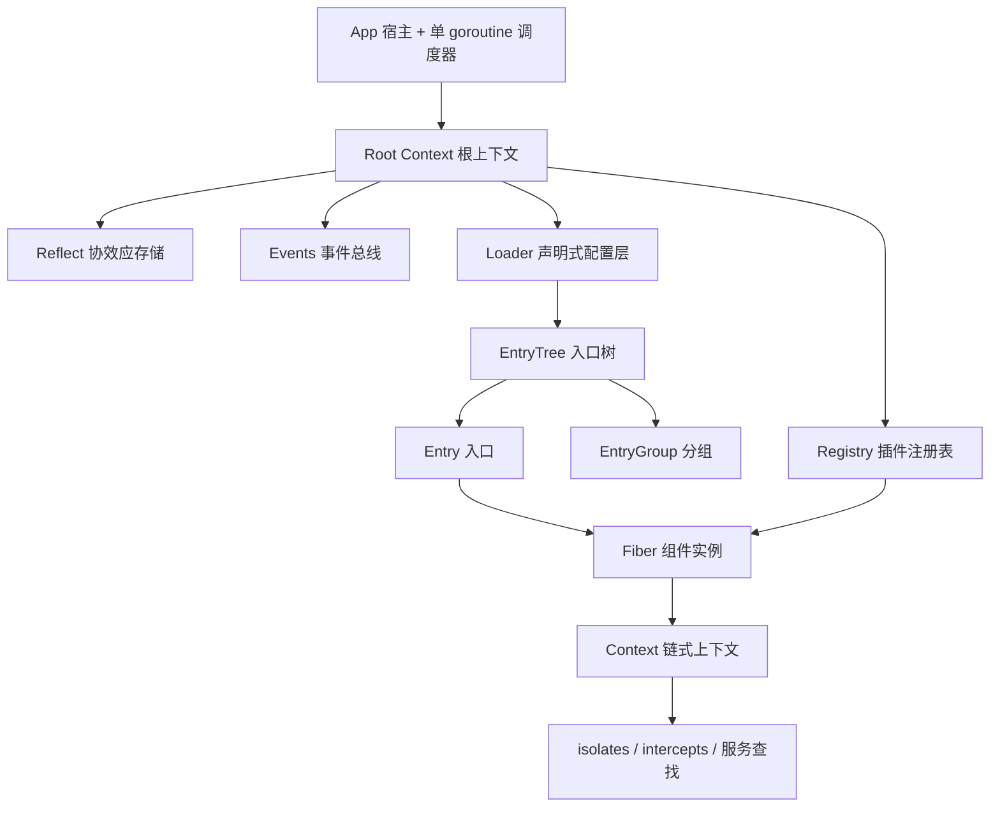
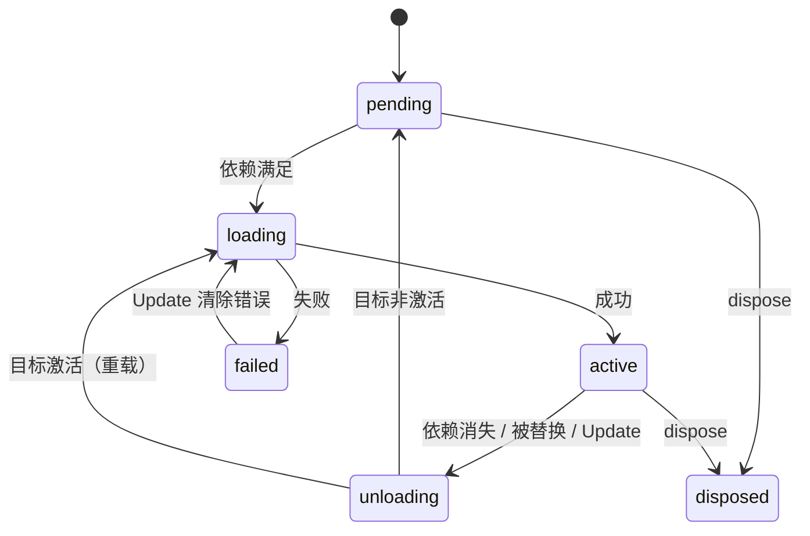

# Cordis (Go)

[](https://github.com/corecraft-io/cordis/actions/workflows/ci.yml)

[English](README.md) · **中文**

> 论文《[A Programming Paradigm for Spatiotemporal Composability](https://arxiv.org/abs/2608.25512)》所提出的**时空可组合组件模型**的纯 Go 实现。
> 零第三方依赖 · 单 goroutine 免锁运行时 · 89 项测试全绿（含 `-race`）· Apache-2.0

---

## 1. 项目简介

`cordis` 是一套**组件运行时**：它让「组件」在两个维度上同时可组合。

| 维度 | 主张 | 本实现的机制 |
| --- | --- | --- |
| **时间维** | 每个副作用都携带**显式的逆操作**，由运行时追踪；组件卸载时环境被完全还原 | `ctx.Effect` / `ctx.Provide` / `ctx.On` 一律返回 `Dispose`，Fiber 卸载时按 **LIFO 逆序**自动回收 |
| **空间维** | 组件以**协效应（coeffect）**声明对服务的依赖；依赖满足状态变化时，运行时自动驱动组件的加载与卸载 | `Plugin.Inject` 声明依赖 → `epoch` 推导目标视图 → 状态机自动奔跑 |

一句话：**你只声明「我要什么」和「我怎么创建」，运行时负责在正确的时机创建、在依赖消失时彻底拆掉。**

---

## 2. 核心概念

| 概念 | 论文 / 官方 TS 实现 | 本实现 | 说明 |
| --- | --- | --- | --- |
| 组件定义 | plugin | `Plugin` | `Name` + `Inject`（协效应）+ `Validate`（配置校验）+ `Apply`（组件逻辑） |
| 组件实例 | fiber / scope | `Fiber` | 持有效果追踪表、依赖快照、对外服务表与生命周期状态机 |
| 目标视图 | `epoch` | `epoch`（未导出） | 由当前依赖实现集合推导；任何替换都产生新 epoch |
| 协效应存储 | `ReflectService` | `Reflect` | `isolateKey{name, realm}` → 服务实现的全局映射 |
| 隔离域 | isolation / realm | `Context.Isolate` | 同名服务在不同域中互不可见，支持多套服务栈并存（多租户） |
| 拦截配置 | intercept | `Context.Intercept` | 由服务提供者读取的构造期配置，沿上下文链合并 |
| 事件总线 | events | `Events` | 监听器随注册它的 Fiber 生命周期自动回收 |
| 声明式配置 | loader | `Loader` | `Entry` / `EntryGroup` / `EntryTree` + 协调算法 |

上表把论文与官方 TypeScript 实现的每个概念逐一对应到本实现的类型上，便于对照阅读。右列记录 Go 类型实际持有的数据，备注列标出移植时需要留意的语义。

### 与官方实现的有意差异

以下是**有意不对齐**的地方，附理由与把它钉住的测试：

| 方面 | 官方 TS 实现 | 本实现 | 理由 |
| --- | --- | --- | --- |
| `fiber.update` 的错误上报 | `async`：重载失败 reject 给调用方 | `Update` 立即返回；重载失败经 `Err()` / `State() == failed` 暴露 | 调用方通常已经在唯一的调度 goroutine 内部，无法阻塞等待自己的重载（`TestUpdateReportsReloadFailureAsynchronously` 钉住该分歧） |
| 依赖变更通知 | 遍历全部 runtime × fiber 全量扫描 | 以隔离域键分桶的倒排索引（`Reflect.index`），`filter` 参数已**有意删除** | 全量扫描在 insula 的 10000 租户下实测退化为 O(N²)；确需自定义路由就另建一张索引，而不是加回 filter |
| 事件名 | 字符串或 symbol | 仅字符串 | Go map 没有原型链，官方测试专门防的 `__proto__` / `toString` 污染在 Go 里根本不会发生 |
| 服务访问 | `Context` 是 Proxy；`Service` 基类、`accessor` / `mixin`、可调用服务、`shadow` / traceable 接收者 | 普通结构体与方法；`Get` / `Provide` / `Intercept` 覆盖同等场景 | Proxy 层是为了让 `ctx.foo` 在 JS 里成为属性读取；Go 显式解析服务。因此官方的 `associate` / `shadow` / `invoke` 三组测试属 **N/A**，不是缺漏 |
| 效果 | 可为异步（`Promise`、async generator），撤销可 await | 同步 `Dispose`；异步清理用两阶段 `disposeStep{run, wait}` 表达，由 `Wait()` 汇报收敛 | 同上：单调度 goroutine，无 Promise 机制 |
| 配置校验 | Standard Schema（`~standard.validate`） | `Plugin.Validate func(any) (any, error)` | Go 没有 Standard Schema；错误契约（结构性失败 vs 配置失败）保持一致 |
| `@Inject` 装饰器 | 类方法装饰器 | N/A | Go 无装饰器；`Plugin.Inject` 与 `ctx.Inject` 表达同一件事 |
| `getEffects()` | 带 `children` 的 `EffectMeta` 树 | 按注册序平铺的标签列表 | 官方的生成器效果会为每个 yield 建立子效果对象；Go 的增量效果只是普通撤销动作，没有可挂靠的父节点 |
| 配置表达式 | 丰富的 `${…}` 形态（跨入口引用、拼接） | 仅 `${env:NAME}` | 其余属于嵌入方职责，本层不发明私有语法 |
| 日志消息的目标实例 | 每条 `LogMessage` 挂 `WeakRef<Fiber>` | `FiberName` + `UID` | Go 没有弱引用；在 1000 条的缓冲里持强 `*Fiber` 会把已注销实例拖住 |

### 覆盖矩阵（N/A 项）

官方包与测试中没有对应形态的部分（依赖 Go 不存在的语言/平台机制）：

| 官方项 | 为何不适用 | 本实现用什么覆盖同一需求 |
| --- | --- | --- |
| `associate`（属性注入 `ctx.foo.bar`） | `Context` 不是 Proxy，没有属性访问拦截 | 按名字显式 `ctx.Get` / `ctx.Provide` |
| `shadow` / traceable 调用者 | 服务值外没有 `this` 绑定层 | 调用方按自己的域解析；`Get` 的可见性本身按域划分 |
| `invoke`（可调用服务） | Go 没有可调用对象 | 服务值 + 方法，按名字解析 |
| `@Inject` 装饰器 | Go 无装饰器 | `Plugin.Inject` 与 `ctx.Inject` |
| `accessor` / `mixin` | Proxy 的 `get`/`set` 陷阱 | 拦截配置（`Intercept` / `InterceptOf`） |
| `loader/src/resolve.ts`（ESM 解析） | Go 无模块系统 | `NewLoader` 的解析器函数，外加 `Loader.Builtins` 处理 `cordis:<名字>` |
| `packages/hmr`（模块热替换） | 没有可重读的模块注册表 | 热重载即 `Fiber.Update`；换定义即 `Registry.Delete` + 重新注册 |
| `packages/timer` | 上游是独立包 | 一个普通效果即可，见 `example/main.go` 的定时器场景 |
| `packages/logger-console`（终端着色） | 上游是独立包 | 默认 stderr 出口；着色与版式交给自定义 `Exporter` |
| `packages/include`（配置文件 include/patch） | 上游是独立包 | 持久化由嵌入方负责；写入后调用 `Loader.NotifyConfigUpdate()` |
| `packages/group`、`packages/create` | 脚手架 / 多应用辅助 | 运行期的一半由 `EntryGroup`（嵌套入口）承担；脚手架不在范围内 |
| `Plugin.provide` / `Plugin.intercept` | 上游**仅在类型里声明**，`packages/core` 中无任何消费点（是 `Service` 基类与 inject 键类型的约定） | 组件自行 `ctx.Provide`；拦截配置由入口的 `EntryOptions.Intercept` 声明 |
| loader 的 `intercept: { loader: { await: true } }` | 该 check 要读**消费者**的 intercept 链，而它只能经 traceable/shadow 接收者传导到服务上 | N/A（见 shadow 行）；下游需要的话自行判定 pending 状态 |
| `internal/get` 的 error 参数 | 上游会传一个监听器可抛出的 `Error` 对象 | 链尾返回 `ServiceLookup{Value, OK}` | Go 没有穿过 Proxy 处理器的异常传递 |

| `loader/patch-context` | 监听器就地改写上下文的 isolate/intercept 表 | 用洋葱链**环绕**重建 | Go 的上下文链不可变，监听器只能观察并给重建排序，不能就地改域表 |

---

## 3. 架构总览



分三层：

1. **宿主层** —— `App` 持有根上下文与调度器 goroutine；`App.Do` / `App.DoSync` 是外部 goroutine 的唯一合法入口。
2. **运行时层** —— `Fiber` / `Context` / `Reflect` / `Registry` / `Events` 构成效果追踪与依赖解析的全部机制。
3. **声明式配置层** —— `Loader` / `EntryTree` / `EntryGroup` / `Entry` 把「实例化组件」从过程式代码变为可协调的配置树。

### 文件职责

| 文件 | 行数 | 职责 |
| --- | --- | --- |
| `cordis.go` | 105 | 包文档、`FiberState`、错误值集合、`Plugin` 定义 |
| `app.go` | 225 | `App` 宿主、单 goroutine `scheduler`、`Wait` / `Close` |
| `context.go` | 339 | 统一上下文、`Isolate` / `Intercept` 派生、`Get` / `Provide` 门面 |
| `fiber.go` | 667 | Fiber 状态机、`epoch` 惯性追逐、效果与 LIFO 撤销、效果自省、局部更新钩子、配置热更新 |
| `reflect.go` | 294 | 协效应存储、域键解析、依赖倒排索引与变更通知（dependant-first） |
| `registry.go` | 265 | `Plugin → Runtime` 映射、`Plugin` / `PluginInject` / `Inject` 实例化入口与遍历 API |
| `logger.go` | 369 | 日志级别、命名日志器、出口与有界消息缓冲 |
| `events.go` | 337 | 事件总线（`Emit` / `Serial` / `Bail` / `Parallel` / `Waterfall`）与监听器路由 |
| `disposable.go` | 92 | 两阶段撤销步骤 `disposeStep` 与保序 `disposableList` |
| `loader.go` | 970 | 声明式配置层：`EntryOptions` / `Entry` / `EntryGroup` / `EntryTree` / `Loader` |
| `example/main.go` | 290 | 端到端示例：热重载 / 降级 / 隔离域 / 全树快照 / 日志 / 洋葱链 / 定时器效果 |
| `cordis_test.go` | 2171 | 核心运行时测试（43 项 + 1 基准） |
| `alignment_suite_test.go` | 201 | 移植的官方用例：并发更新、嵌套插件、提交读写规则（3 项） |
| `loader_test.go` | 887 | 声明式配置层测试（17 项 + 1 基准） |
| `loader_events_test.go` | 413 | loader 事件面、全树快照、内置插件、日志、嵌套域（7 项） |
| `loader_config_test.go` | 127 | 配置插值与回写的 `Simplify` 钩子（2 项） |
| `logger_test.go` | 252 | 日志命名、级别过滤、出口与环形缓冲（5 项） |
| `index_internal_test.go` | 494 | 依赖倒排索引的生命周期不变量（白盒） |
| `disposable_internal_test.go` | 125 | 墓碑压缩的不变量与基准（1 项 + 3 基准，白盒） |
| `registry_internal_test.go` | 145 | `Runtime` 增删一致性（白盒） |
| `events_internal_test.go` | 127 | 事件桶生命周期与监听器泄漏快照（2 项，白盒） |

---

## 4. 快速开始

```bash
git clone https://github.com/corecraft-io/cordis.git
cd cordis

go test ./...          # 89 项测试
go test -race ./...    # 竞态检测
go vet ./...
go run ./example       # 端到端示例，打印各入口状态
```

### 作为依赖使用

```sh
go get github.com/corecraft-io/cordis
```

```go
import cordis "github.com/corecraft-io/cordis"
```

若要在本地与依赖它的项目一起改 cordis，用 Go workspace 而不是 `replace` 指令——
`replace` 在你的模块被当作依赖时会**被忽略**，而且本地的 `replace` 还会弄坏 `go install`。
在**两个检出目录之上**、不属于任何一个仓库的位置放一个 `go.work`：

```
// go.work
go 1.22

use (
    ./cordis
    ./your-project
)
```

模块路径用完整域名路径，正是为了让上面这个做法成立：裸模块名（如 `cordis`）根本
无法被模块代理解析（`malformed module path "cordis": missing dot in first path element`）。

---

## 5. 使用指南

### 5.1 定义与实例化组件

```go
app := cordis.New()
defer app.Close()

db := &cordis.Plugin{
    Name: "database",
    Apply: func(ctx *cordis.Context, config any) error {
        dsn := config.(string)
        if _, err := ctx.Provide("database", dsn, nil); err != nil {
            return err
        }
        _, err := ctx.Effect("conn", func() (cordis.Dispose, error) {
            return func() { log.Println("close", dsn) }, nil
        })
        return err
    },
}

app.Do(func(ctx *cordis.Context) {
    ctx.Plugin(db, "postgres://prod")
})
```

### 5.2 副作用与撤销

所有副作用都必须能给出逆操作，且 `Dispose` **幂等**。

| API | 用途 |
| --- | --- |
| `ctx.Effect(label, fn)` | 通用效果：`fn` 返回 `Dispose` |
| `ctx.EffectIter(label, iter)` | 增量效果：`yield` 多次登记，全部 LIFO 撤销 |
| `ctx.Provide(name, value, check)` | 注册服务，撤销遵循 **dependant-first**（先等依赖者下线，再销毁自身） |
| `ctx.On` / `ctx.Once` | 注册事件监听器，随 Fiber 卸载自动注销 |

### 5.3 服务与反应式依赖

```go
cache := &cordis.Plugin{
    Name:   "cache",
    Inject: map[string]any{"database": nil}, // 协效应：必需依赖
    Apply: func(ctx *cordis.Context, _ any) error {
        dsn, ok := ctx.Get("database")
        if !ok {
            return errors.New("database unavailable")
        }
        _, err := ctx.Provide("cache", "cache:"+dsn.(string), nil)
        return err
    },
}
```

`database` 提供者下线时，`cache` 的效果被自动回收并回到 `pending`；提供者回归时自动恢复。**无需手写任何监听或重试逻辑。**

`Provide` 的第三个参数 `check func() bool` 用于表达「服务存在但暂不可用」：每次依赖解析都会调用它，返回 `false` 时依赖者立即视为未满足。`check` 内 panic 会被吞掉并按未满足处理（记日志）。

### 5.4 隔离域（多租户）

```go
ctx.Isolate("database", "tenant-a")   // 同域共享，跨域不可见
ctx.Intercept("database", myConfig)   // 供提供者读取的拦截配置
```

在 loader 层用 `EntryOptions.Isolate` 声明：`true` 表示入口私有域（键 `#入口ID`），字符串表示共享域（键 `@标签`）。

拦截配置由 `ctx.InterceptOf(name)` 解析：**沿上下文链自远及近逐层合并**（对应官方 `Service[resolveConfig]`）。两层同为 `map[string]any` 时按键浅合并、近层覆盖同名键；任一层不是 map 就整体替换（非 map 没有"键"可谈）。合并结果总是新 map，提供者改它不会污染声明，也不会串到下一次读取。

### 5.5 事件

| 方法 | 语义 |
| --- | --- |
| `Emit` | 同步分发，忽略返回值与错误（错误记日志） |
| `Serial` | 串行，首个返回非 nil 的监听器终止分发 |
| `Bail` | 同 `Serial`，但同步抛出 panic |
| `Parallel` | 聚合全部错误（单线程下等价于串行） |
| `Waterfall` | 洋葱式分发：每个监听器收到 `(args..., next)`，不调用 `next` 即终止整条链 |
| `EmitFiltered` | 带显式域过滤规则分发 |

`On` / `Once` 可传 `ListenOptions`：

| 选项 | 作用 |
| --- | --- |
| `Prepend` | 插入注册序头部（默认追加到尾部） |
| `Global` | 绕过 isolate 域过滤——对全部域的同类事件可见（默认仅同域） |

分发自始至终在监听器列表的**快照**上进行：分发期间自注销的监听器不会跳过相邻监听器，分发期间新注册的监听器不参与本次分发。

`Waterfall` 是开放扩展点（对应官方实现的 waterfall 模式）：监听器除载荷外还会收到 `next` 续延，`Waterfall` 的 `terminal` 参数即链尾的默认行为。`next` 重复调用——包括存到外层帧再调用——会 panic `ErrDuplicateNext`；`Fiber.Update` 会把该 panic 收敛为错误返回，钩子写错不会击穿调度器 goroutine。

内置事件：`internal/plugin`（实例创建/注销）、`internal/status`（状态迁移）、`internal/service`（服务上下线）、`internal/update`（配置热更新链）、`internal/listener`（注册期扩展点）、`internal/get`（服务读取拦截）、`internal/set`（服务写入拦截）、`internal/dispatch`（观测每一次分发：mode / 事件名 / 载荷 / 分发方上下文；`internal/*` 事件被排除，观测者不会把自己卷进递归）。

`Context.Get` / `Context.Set` 与 `internal/dispatch` 在**无人监听时直接走原路径**，因此只有订阅才产生额外成本。

声明式配置层另发四个（对应官方 `loader/*` 事件）：

| 事件 | 时机 | 载荷 |
| --- | --- | --- |
| `loader/entry-init` | 入口构造完成、上下文尚未派生 | `(entry)` |
| `loader/patch-context` | 入口上下文（重）建——**洋葱链**，监听器可在 `next` 前后各做一步 | `(entry, next)` |
| `loader/partial-dispose` | 入口存活而实例被替换/热重载（`active == true`），或被分组协调摘除（`active == false`） | `(entry, legacy, active)` |
| `loader/config-update` | 配置写入方落盘后自行分发（`Loader.NotifyConfigUpdate`） | `()` |

### 5.6 配置热更新

`fiber.Update(config, noSave...)` 先校验新配置，再把 `internal/update` 作为洋葱链分发：

```
全局钩子（注册序） → 本 fiber 的局部钩子 → 默认行为：替换配置并重启
```

| 机制 | 作用 |
| --- | --- |
| 在 fiber 自己的上下文上 `ctx.On("internal/update", …)` | 经 `internal/listener` 路由到**该 fiber 的局部钩子链**，因此只拦得住本实例的更新；带 Prepend/Global 注册则留在全局桶 |
| `fiber.OnUpdate(hook func(config, noSave) bool)` | 局部钩子的便捷封装；返回 `false` 即完全接管本次更新 |
| 不调用 `next`（或返回 `false`） | 否决本次更新：既不替换配置也不重启 |
| `noSave == true` | 本次更新由宿主（loader）发起，钩子不得把配置回写为持久化配置 |

局部钩子**刻意随卸载/重载存续**（不作为效果登记），loader 的配置回写钩子正是靠它跨热重载存活；反过来，比自己的分组实例活得更久的钩子必须自带陈旧守卫。

### 5.7 声明式配置层

```go
loader := cordis.NewLoader(app, func(name string) (*cordis.Plugin, error) {
    return plugins[name], nil
})

loader.Load([]cordis.EntryOptions{
    {ID: "db",    Name: "database", Config: "postgres://prod"},
    {ID: "cache", Name: "cache"},
    {ID: "web",   Name: "web",      Config: 8080},
})
```

| 操作 | 行为 |
| --- | --- |
| `Load(options)` | 整体协调：新增创建、缺失移除、存留更新，顺序以配置为准 |
| `Create` / `Remove` / `Update` | 单入口增删改；`Update` 支持跨组移动（触发上下文重建 + 完整重载） |
| `EntryGroup` | 分组入口，`Group: true`；禁用级联会禁用全部后代 |
| `EntryOptions.ID` | **全树唯一**（索引以短 ID 为键，寻址用 `group:child` 路径）；重复 ID 被拒绝（跳过并记日志） |
| `EntryOptions.Inject` | 入口级依赖增删覆盖（`cordis.DepRemove` 显式移除声明的依赖） |
| `EntryTree.OnCommit` | 每次结构变更后同步回调，供持久化落盘 |
| `NewLoader` | 同名插件可多次实例化，共享 `Runtime` |
| `EntryTree.Entries()` / `Pending()` | 全树快照：全部入口（按短 ID 升序）/ 实例尚未稳定的入口 |
| `EntryTree.Wait()` / `Loader.Wait()` | 等待全树收敛，返回是否真正稳定 |
| `Loader.Locate(fiber)` | 由实例（含入口内嵌套的子插件）反查其所属入口 |
| `Loader.Builtins(map)` | `Name: "cordis:<键>"` 命中内置插件表，不再走外部解析器 |
| `Loader.SetLogs(true)` | 以 `loader` 日志器记录 `apply` / `reload` / `unload` |
| `Loader.NotifyConfigUpdate()` | 配置落盘后分发 `loader/config-update` |
| 配置插值 | 入口配置里的 `${env:NAME}` 在交给插件前展开（分组配置即子入口列表，不参与）；其余表达式形态交给嵌入方 |
| `Plugin.Simplify` | 回写入口配置前把运行期配置规范化为可持久化形态（对应官方 `Config.simplify`） |
| `Entry.Evaluate(expr)` | 求一个配置表达式的值（对应官方 `entry.evaluate`） |

配置变更的分派规则（`Entry.update`）：

- 禁用（含级联）→ 注销 Fiber 并摘下分组子树；
- 空间声明变化（`Name` / `Group` / `Inject` / `Isolate` / `Intercept`）→ **同步摘下旧子树**、注销旧实例，再以新声明完整重载（旧实例的效果回收是异步的，子树结构必须立即一致，否则重建时短 ID 索引冲突）；
- 仅 `Config` 变化 → 走 `Fiber.Update(config, true)`（`noSave`：loader 发起的更新不回写入口配置）热重载；配置未过 `Validate` 时 Fiber 进入 `failed` 并保留在入口上，修正后原地恢复；
- 分组入口 → 通过更新钩子协调子入口，而非重启自身；分组配置类型错误（非 `[]EntryOptions`）记日志并保留现有子入口。

### 5.8 日志

```go
app.Logger()                       // *LoggerService：出口表 + 环形缓冲
ctx.Logger()                       // 以当前插件命名的日志器
ctx.Logger("database")             // 显式命名
ctx.Intercept("logger", cordis.LoggerOptions{Name: "db", Level: cordis.LevelDebug})
```

| 组成 | 行为 |
| --- | --- |
| `Logger` | 一个名字 + 一个级别阈值；`Error` / `Warn` / `Info` / `Debug` 接受格式串与参数 |
| 名字解析 | 显式参数 → `logger` 拦截配置 → 所属插件名（不在插件内为 `root`） |
| `LogMessage` | `Seq` · `Time` · `Name` · `Level` · `Text` · `FiberName` · `UID` |
| `Exporter` | 一个出口，自带 `Levels` 表；某名字的阈值按 `Levels[名字]` → `Levels[""]` → 日志器自身级别（默认 `LevelInfo`）取 |
| `App.Logger().Exporter(e)` · `ctx.Logger().Exporter(e)` | 追加出口并返回幂等的 `Dispose`。它**不是** fiber 效果：日志出口通常要比注册它的实例活得久 |
| `Capture` / `Silence` | 替换 / 关闭默认的 stderr 出口（测试与嵌入方用） |
| 环形缓冲 | 默认 `DefaultBufferSize`（1000）条，超出丢最旧；`Messages()` 取快照，`SetBufferSize(n)` 调整（`0` 表示不缓存）。缓冲跟随日志器自身阈值，等价于“一个不带 Levels 的出口” |

运行时报出的全部信息——`apply` 失败、撤销 panic、事件监听器 panic、loader 结构变更——都走这条通路，并带上插件名。

---

## 6. 并发模型

复刻 JavaScript 单线程事件循环：`App` 内置**唯一一个**调度 goroutine，全部状态转换任务在其中**串行**执行。

- **用户回调（`Apply` / `Dispose` / 事件监听器）天然运行于调度器内**，可直接调用 `Context` 上的任何 API，**无需加锁**。
- 外部 goroutine 一律通过 `App.Do`（异步）或 `App.DoSync`（同步阻塞）进入。
- ⚠️ **不得在调度器上下文内调用 `DoSync` / `Wait`** —— 会死锁。
- 任务队列为**无界 slice + 互斥锁**（不是固定容量 channel）：单个任务内部继续投递任务不会自阻塞，语义与 JS 事件循环一致。

`App.Wait()` 阻塞至队列排空且全部 Fiber 稳定，**返回是否真正收敛**（调度器已停止或达到轮询上限后放弃时返回 `false` 并告警）；`App.Close()` 冻结根 fiber 目标视图，沿效果链级联回收全部子组件并停止调度器（可安全重复调用）。

---

## 7. 生命周期状态机

| 状态 | 含义 |
| --- | --- |
| `pending` | 已注册但依赖未满足，等待激活 |
| `loading` | 依赖已满足，正在执行组件逻辑 |
| `active` | 组件逻辑执行成功且全部依赖仍然满足 |
| `failed` | 曾在 `active` 之后执行失败；效果已回收，等待下次 `Update` 恢复 |
| `unloading` | 正在按 LIFO 逆序回收效果 |
| `disposed` | 已从父上下文注销，生命周期终结 |



**epoch 惯性链**：epoch 变化并不立即执行转换，而是把 `pump` 任务投递到调度器。`pump` 按**最新** epoch 决策，转换完成后若 epoch 又变（同步代码在转换期间再次改变目标视图）则继续追逐，直到现状与目标一致——等价于官方实现的 reload/unload 相互链式触发。

---

## 8. API 速览

### `App`

| 方法 | 说明 |
| --- | --- |
| `New()` | 创建应用并启动调度器 |
| `Do(f)` / `DoSync(f)` | 在调度器上异步 / 同步执行；`DoSync` 返回任务是否确实执行完毕 |
| `Root()` | 根上下文（仅限调度器上下文使用） |
| `Wait()` | 等待系统稳定，返回是否收敛 |
| `Close()` | 级联回收全部组件并停止调度器 |
| `Logger()` | 日志服务 `LoggerService`：出口表、环形缓冲，以及 `Error` / `Warn` / `Info` / `Debug` 快捷方法 |

### `Context`

| 方法 | 说明 |
| --- | --- |
| `Get(name)` / `GetMust(name)` | 解析服务（沿 Fiber 链向上，域感知；提供者未 `active` 时视为不可见） |
| `Provide(name, value, check)` | 注册服务，返回与 Fiber 绑定的 `Dispose` |
| `Set(name, value)` | 更新本 Fiber 已注册的服务值 |
| `Effect` / `EffectIter` / `On` / `Once` | 效果与事件 |
| `Emit` / `Serial` / `Bail` / `Parallel` / `Waterfall` | 五种分发模式 |
| `Get` / `Set` | 服务解析与更新，两者都可经 `internal/get` / `internal/set` 拦截 |
| `Isolate(name, realm)` / `Intercept(name, cfg)` / `InterceptOf(name)` | 空间维声明 |
| `Plugin(p, config)` / `Inject(deps, apply)` | 实例化组件 / 声明动态依赖 |
| `App()` / `Fiber()` / `Root()` / `Entry()` | 上下文导航 |

### `Registry` 的错误契约

| 返回 | 含义 |
| --- | --- |
| `(nil, err)` | 结构性失败（插件无效或父上下文已失活），Fiber 从未注册 |
| `(f, err)` | 配置未通过 `Validate`——Fiber 已注册且处于 `failed`，可经 `f.Update` 修复或 `f.Dispose` 注销 |
| `(f, nil)` | 成功 |

### `Fiber`

`State()` · `Err()` · `Config()` · `UID()` · `Effects()` · `Restart()` · `Update(config, noSave…)` · `OnUpdate(hook(config, noSave) bool)` · `Dispose()` · `Effect(label, fn)` · `EffectIter(label, iter)`

### 包级助手

`Is(value)`（官方 `Context.is`）· `InjectList(names…)`（官方 inject 的数组形式）· `ServiceLookup{Value, OK}`（`internal/get` 链尾载荷）

### 日志

`LogLevel`（`LevelError` < `LevelWarn` < `LevelInfo` < `LevelDebug`）· `LogMessage` · `Exporter{Levels, Export}` · `LoggerOptions{Name, Level}` · `Logger{Name, Level, Service, Exporter, Error, Warn, Info, Debug}` · `LoggerService{Logger, Exporter, Capture, Silence, Messages, BufferSize, SetBufferSize, Error, Warn, Info, Debug}`

### 错误值

`ErrInactiveEffect` · `ErrServiceDuplicate` · `ErrServiceNotFound` · `ErrServiceNotSet` · `ErrInvalidPlugin` · `ErrEntryNotFound` · `ErrDuplicateNext`

---

## 9. 示例输出

`go run ./example` 覆盖以下场景。

| 场景 | 观察点 |
| --- | --- |
| 初始加载 | 依赖序驱动：`database` → `cache` → `web` |
| 热重载 `web: 8080 → 9090` | 旧实例先 `shutdown`，新实例再 `listen` |
| `db` 禁用 / 恢复 | `cache`、`web` 自动回到 `pending`，恢复后自动 `active` |
| 隔离域多租户双栈 | `tenant-a` / `tenant-b` 同名服务并存互不干扰 |
| 动态移除 `db-b` | 该栈整体降级，`tenant-a` 不受影响 |
| 全树快照 | `Entries()` 按短 ID 稳定排序；`Wait()` 报告收敛、`Pending()` 为空 |
| 命名日志器 | 显式名压过插件名；低于 `info` 阈值的 `debug` 不进缓冲 |
| 洋葱式分发链 | `(21 * 2) + 1000` —— 内层翻倍、外层加、终端给基数 |
| 定时器效果 | 旧 goroutine 先停表、新 goroutine 再启动（LIFO）；注销会等它真正退出；每次 tick 都经 `App.Do` 回到调度器 |

---

## 10. 测试覆盖

`go test ./...` → **89 项全部通过**；`go test -race ./...` 无竞态报告；另有 5 个基准（`-bench .`）。

CI（`.github/workflows/ci.yml`）在 **Go 1.22.x**（`go.mod` 声明的最低版本）与 **stable** 两档上执行：`gofmt -l` 零差异、`go vet`、`go build`、`go test -race`、基准运行、`go run ./example` 冒烟。

**核心运行时（`cordis_test.go`，43 项）**

| 测试 | 覆盖点 |
| --- | --- |
| `TestPluginLifecycle` | 生命周期状态迁移 |
| `TestReactiveCoeffects` | 反应式依赖：提供者上下线驱动依赖者 |
| `TestDependantFirstDispose` | 撤销顺序保证 |
| `TestIsolation` / `TestSharedRealm` | 私有域 / 共享域语义 |
| `TestHotReload` | 配置热重载 |
| `TestFailureAndRecovery` | `apply` 失败与 `Update` 恢复 |
| `TestConfigValidation` / `TestPluginErrorContract` | `Validate` 失败路径与错误契约 |
| `TestServiceEvents` | `internal/service` 事件 |
| `TestDuplicateProvide` | 同域重复注册 |
| `TestEpochChase` | 转换期间 epoch 再次变化的追逐 |
| `TestEventListenerCleanup` | 监听器随 Fiber 回收 |
| `TestRootCloseCascades` | 根关闭级联 |
| `TestCheckFunction` | `check` 不健康判定 |
| `TestServiceHiddenWhileProviderUnloading` | 撤销窗口内服务可见性 |
| `TestDisposePanicLogged` | 撤销 panic 被记录且不阻断后续 |
| `TestWaitReportsConvergence` | `Wait` / `DoSync` 的收敛与执行结果上报 |
| `TestSchedulerUnboundedQueue` | 单任务内超量投递不自死锁 |
| `TestConcurrentExternalCalls` | 8 goroutine 混合 `Do`/`DoSync`：任务不丢失不重复、调度严格串行、执行结果如实上报 |
| `TestConcurrentPluginRegistration` | 并发注册 160 个实例，全部收敛为 `active` |
| `TestConcurrentCloseWithPosts` | `Close` 与外部投递并发：无死锁、无 panic、幂等 |
| `TestWaterfallChain` / `TestWaterfallShortCircuit` | 洋葱式分发：`next` 串起整条链，不调用 `next` 即中断，`terminal` 是链尾默认行为 |
| `TestWaterfallDuplicateNextPanics` / `TestWaterfallStaleNextPanics` | 重复使用 `next`（同帧或存到外层帧）panic `ErrDuplicateNext` |
| `TestEventPrependOrder` | `ListenOptions{Prepend: true}` 插入注册序头部 |
| `TestEventDispatchSnapshot` | 分发在快照上进行：自注销不跳过相邻监听器，分发中登记的监听器本次不生效 |
| `TestEventGlobalBypassesRealmFilter` | `ListenOptions{Global: true}` 可观察其它域的 `internal/service` 事件 |
| `TestRegistryIteration` | `Values()` / `Keys()` / `ForEach()` 按注册序、随注销收缩、遍历快照 |
| `TestInternalDispatchObserver` | 五种分发模式都被观测到，`internal/*` 不触发观测 |
| `TestServiceReadWriteInterception` | `internal/get` 可改写/覆盖读取；`internal/set` 可否决写入（`ErrServiceNotSet`） |
| `TestFiberEffectsIntrospection` | `Effects()` 按注册序列出存活效果标签，注销后清空 |
| `TestFiberRestart` | `Restart()` 重载但不换配置，且救不回 failed 的实例 |
| `TestContextIsAndInjectList` | `Is()`（含 nil 指针情形）与 inject 的数组形式 |
| `TestUpdateWhileDependencyReloads` | 提供者与依赖者同时更新，收敛到最终组合、不出现中间态 |
| `TestNestedPluginSnapshot` | Apply 里实例化的子插件自成 Runtime 与 `ctx.plugin()` 效果，并随父级联注销 |

| `TestUpdateEventHookScope` | 非 global 的 `internal/update` 监听器只拦本 fiber；global 的对所有 fiber 生效 |
| `TestUpdateHookNoSaveAndVeto` | `noSave` 抵达钩子；返回 `false` 即否决配置替换与重启 |
| `TestUpdateHookDuplicateNextIsReported` | 钩子误用 `next` 时 `Update` 返回错误而非击穿调度器 |
| `TestInternalListenerTakesOver` | `internal/listener` 可接管注册，并自行负责注销 |
| `TestInterceptChainMerges` | 拦截配置沿上下文链合并（近层按键覆盖）；结果不与任何声明共享 |
| `TestUpdateReportsReloadFailureAsynchronously` | 钉住有意差异：重载失败**不**同步回报，校验失败同步回报 |
| `TestEffectIterPanicReclaimsYielded` | `iter` 中途 panic 时已 yield 的部分按 LIFO 回收，且 panic 继续上抛 |
| `TestFailedFiberDoesNotReenterOnDependencyRefresh` | 失败的 fiber 在依赖反复上下线中保持冻结，只有 `Update` 能恢复 |

**声明式配置层（`loader_test.go` 17 项 + `loader_events_test.go` 5 项）**

| 测试 | 覆盖点 |
| --- | --- |
| `TestLoaderBasicLoad` / `TestLoaderReconcile` / `TestLoaderConfigReload` | 加载、整体协调、配置热重载 |
| `TestLoaderGroup` / `TestLoaderGroupIsolateRebuild` / `TestLoaderGroupConfigTypeError` | 分组协调、空间声明变化重建、配置类型错误保留子树 |
| `TestLoaderEntryIsolate` / `TestLoaderEntryInject` | 入口级域与依赖声明 |
| `TestLoaderTreeOperations` / `TestLoaderGroupMoveRebuild` | 入口树增删改与跨组移动（含分组子树同步摘下重建） |
| `TestLoaderDuplicateShortID` | 重复短 ID 拒绝（含跨组） |
| `TestLoaderConfigErrorRecovery` | 校验失败后原地恢复 |
| `TestLoaderCommitHook` / `TestLoaderSelfDispose` | 提交钩子、插件自行卸载 |
| `TestLoaderLargeLoad` | 1100 入口单次 Load 不死锁 |
| `TestLoaderIsolateMigration` | 两侧加减 `isolate`（relevant / irrelevant 服务名、共享域引用）与「注销重建」等效 |
| `TestLoaderIsolateTransfer` | 跨组移动不改变域身份 |
| `TestLoaderEventSurface` | `entry-init` / `patch-context`（链的两侧都执行）/ `partial-dispose`（`active` 真假两种）/ `config-update` |
| `TestLoaderEntriesAndWait` | `Entries()` 覆盖全树且顺序稳定；收敛后 `Pending()` 为空（依赖未满足也是稳定态） |
| `TestLoaderLocate` | 实例（含入口内嵌套的子插件）反查回自己的入口 |
| `TestLoaderBuiltins` | `cordis:<名字>` 命中内置表，且**不**回落到外部解析器 |
| `TestLoaderLogs` | `SetLogs` 打开后才按 apply / reload / unload 记录，分组入口自身不记录 |
| `TestLoaderNestedRealms` | 子入口继承分组域；共享标签与私有域覆盖继承值 |
| `TestLoaderChangeProviderOrInjector` | 换提供者或依赖者所在域都会重建并按新域重新解析 |
| `TestLoaderConfigInterpolation` | 入口配置里的 `${env:NAME}` 展开（分组配置除外）与 `Entry.Evaluate` |
| `TestPluginSimplify` | 回写钩子先把运行期配置规范化再落回入口 |
| `TestCommitReportsOnlyWrites` | 只读不提交；跨组移动报告 `From` 与 `Group` |
| `TestServiceInjectLeavesNoStaleState`（白盒） | 反复上下线后 `deps` 不留陈旧实现、倒排索引不增长 |


**日志（`logger_test.go`，5 项）**

| 测试 | 覆盖点 |
| --- | --- |
| `TestLoggerNameResolution` | 显式名 > 拦截配置名 > 插件名，且消息带上产出实例 |
| `TestLoggerLevelFiltering` | 出口阈值优先级 `Levels[名字]` → `Levels[""]` → 日志器自身级别 |
| `TestLoggerExporterDispose` | 追加出口可注销且幂等，默认出口不受影响 |
| `TestLoggerBufferIsBoundedAndChronological` | 环形缓冲有界、保序、可缩容，`0` 表示不缓存 |
| `TestLoggerSilence` | 静音默认出口后缓冲仍照常记录 |

**内部不变量（白盒）**

`TestReflectIndexLifecycle`（`index_internal_test.go`）—— 依赖倒排索引的 track/untrack 严格配对：注销、未注册失败路径与 `Close` 级联后索引回空。

`TestDisposableCompactionPreservesOrder`（`disposable_internal_test.go`）—— 墓碑压缩确实触发（`order > 8` 且 `order > 2×存活数`），且按 `id` 排序重建后 LIFO 序不破。

`TestRuntimeRemoveConsistency` / `TestRuntimeRemoveThroughDispose`（`registry_internal_test.go`）—— 乱序注销下 `Runtime.fibers` / `Runtime.index` 始终自洽（ADR-0007 的 O(1) 交换删除路径），`Close` 级联后两者同时清空。

`TestEventBucketLifecycle` / `TestEventListenerNoLeakAcrossPluginTeardown`（`events_internal_test.go`）—— 空桶被**删除**而不是留下 `len == 0` 的键；注销插件实例后桶快照精确回到基线（对应官方 `getHookSnapshot` 的对比断言）。

**基准**

| 基准 | 度量对象 |
| --- | --- |
| `BenchmarkServiceNotify` | 服务上下线通知代价（倒排索引前后对比见提交历史） |
| `BenchmarkLoaderLoad` | 声明式协调吞吐 |
| `BenchmarkDisposableSteadyChurn` | 固定存活集持续更替的摊还成本（含摊入的墓碑重建） |
| `BenchmarkDisposableCompaction` | 隔离的单次 `order` 重建（map 遍历 + 排序） |
| `BenchmarkDisposableClear` | `clear` 成本与历史操作量的关系（压缩生效时应持平） |

墓碑压缩基准的实测数据（`GOGC=off`、`-benchtime 200000x`）：存活集 64× 增长时单次更替从 78 ns 到 113 ns（1.45×）；历史操作量 64× 增长时 `clear` 稳定在约 0.8 µs，印证 `order` 未随运行时长累积。

---

## 11. 参考

- **论文**：[A Programming Paradigm for Spatiotemporal Composability](https://arxiv.org/abs/2608.25512)（arXiv:2608.25512 · [DOI](https://doi.org/10.48550/arXiv.2608.25512)，北京大学 & DeepSeek-AI 联合署名，2026-08-26）—— 时空可组合组件模型的理论来源；论文源文件见 [cordiverse/paper](https://github.com/cordiverse/paper)。
- **官方 TypeScript 实现**：[cordiverse/cordis](https://github.com/cordiverse/cordis)（npm [`cordis`](https://www.npmjs.com/package/cordis)，MIT）—— 本仓库逐模块对照的语义基准（概念映射见 §2）。
- 包级设计说明见 `cordis.go` 顶部注释；各模块内部设计取舍见对应源文件注释。

---

## 12. 许可

本项目采用 [Apache License 2.0](LICENSE) 授权，全文见仓库根目录 `LICENSE`。

```
Copyright 2026 corecraft-io

Licensed under the Apache License, Version 2.0 (the "License");
you may not use this file except in compliance with the License.
You may obtain a copy of the License at

    http://www.apache.org/licenses/LICENSE-2.0

Unless required by applicable law or agreed to in writing, software
distributed under the License is distributed on an "AS IS" BASIS,
WITHOUT WARRANTIES OR CONDITIONS OF ANY KIND, either express or implied.
See the License for the specific language governing permissions and
limitations under the License.
```

> 注意：本仓库对照的**官方 TypeScript 实现**为独立项目，其授权与本仓库无关；论文版权归原作者所有。